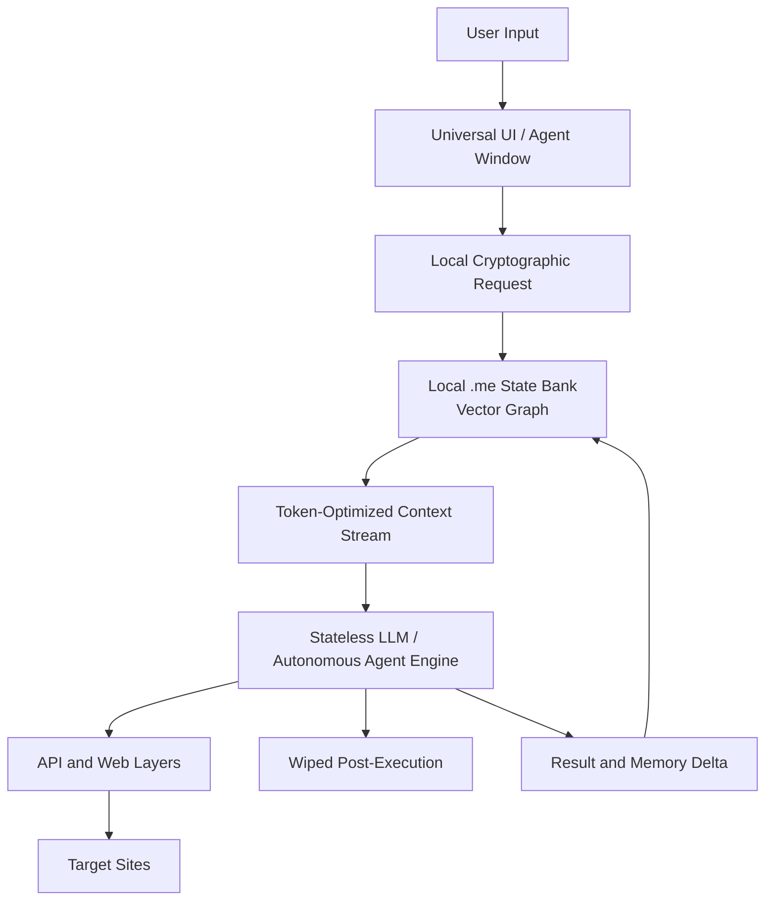

# Architecture and Product Manifesto: The `.me` Protocol

## 1. Executive Summary

The current internet architecture relies on centralized data persistence. Companies capture user data, store it in siloed databases, and use it to render rigid, cluttered, ad-driven interfaces.

The web is moving toward an ultra-abstracted agentic model. In this future, traditional graphical user interfaces are increasingly replaced by a singular AI agent interface. Users will not always navigate websites directly; autonomous agents will fetch data, execute tasks, and communicate with APIs in the background.

That shift creates a security, privacy, and utility vacuum. If large platforms control both the agent layer and the context data, user sovereignty is weakened.

The `.me` protocol is a decentralized context-state standard that flips the data ownership model. Instead of platforms holding the user's context, the user retains a dynamic, encrypted, locally stored digital twin: the `.me` file. When interacting with an abstracted web interface, the user can dynamically stream contextual state to an AI agent on an ephemeral, narrowly scoped basis.

## 2. Core Architecture: The Local State Bank

The `.me` file is not a static text document. It is a locally hosted, cryptographically secured, dynamically evolving vector knowledge graph and state bank.

### Local Sovereignty

The primary ledger exists on the user's physical device or trusted edge storage. It does not live by default on a cloud server owned by a third party.

### Continuous State Evolution

The file continuously updates as the user completes tasks, changes preferences, reads articles, updates their schedule, edits documents, and interacts with services. A local background process synthesizes this information, vectorizes it, and updates the `.me` graph.

### Ephemeral Context Handshakes

When a user interacts with an AI-driven web utility, the `.me` file does not dump its contents. It creates a temporary cryptographic handshake and streams only the specific embeddings, structured facts, constraints, and authorization scopes required for the current execution loop.

### Zero Persistence Retention

Once the AI agent executes the user's prompt, the session terminates and the remote interface should retain no user data. The history and memory of the event are piped back into the local `.me` ledger, and remote session caches are wiped or expire by protocol requirement.

## 3. User Experience and Data Flow

### Step 1: Ambient Interface

The user interacts with a lightweight, non-intrusive interface such as a universal hotkey chat bar, an OS-level sidebar, or a native terminal.

### Step 2: Intent Pipeline

The user enters an abstract command:

```text
Analyze my industry network, find three relevant founders,
and draft personalized outreach matching my writing tone from last week.
```

### Step 3: Context Injection

Before routing the request to a foundational model or external API, the `.me` client:

1. Queries the local `.me` state bank.
2. Retrieves the user's relevant network graph, writing-tone profile, and operational constraints.
3. Packages the result into a dense, token-optimized context payload.

### Step 4: Execution and Stateless Disconnect

The AI agent executes the task across APIs and web services using temporary authorization from the `.me` client. Once completed, the output is displayed to the user and third-party endpoints lose access to the state.

### Data Flow



## 4. Market Positioning

Identity is not just an application, wrapper, or browser extension. The ambition is infrastructure-level: a foundational context and authorization layer for the agentic web.

### Anti-Middleman Immune System

Browser extensions that modify website HTML are fragile and can be squeezed out by platforms. The `.me` protocol operates below the visual interface layer by defining how models and services interact with human identity and contextual state.

### Antidote to Walled Gardens

Large platforms want users inside their own AI ecosystems. A platform-agnostic `.me` file acts as a universal currency of context that different models, operating systems, and services can accept.

### PayPal for AI Agents

Just as PayPal created a trusted settlement layer for human ecommerce, the `.me` protocol aims to create an identity, context, and authorization layer for autonomous agents.

## 5. Technical Principles

### Privacy Architecture First

Assume zero-trust cloud infrastructure. Data synthesis should happen client-side through local models, WebGPU acceleration, or other local compute paths before updating the master `.me` vector store.

### Protocol Interoperability

The `.me` schema should be parseable by external agent systems. A likely direction is a JSON-LD structured schema combined with a dynamic vector matrix and signed authorization envelopes.

### Headless Operation

Target applications may not have human-facing GUIs. The `.me` file should act as the translation layer between raw human intent and machine-to-machine structured endpoints.

## 6. Open Product Questions

- What is the minimum viable `.me` schema?
- Which state belongs in structured JSON-LD versus embeddings?
- What does revocation look like for temporary agent authorization?
- How should local background synthesis ask for user consent?
- What are the first three killer workflows that prove the protocol?
- Which integrations should be first-class: calendar, email, contacts, browser history, documents, code, or CRM?

## 7. Near-Term Build Path

1. Define the `.me` file format and schema primitives.
2. Build a local state bank prototype with encrypted storage and semantic retrieval.
3. Create a minimal ambient command interface.
4. Implement scoped context packaging for a small number of workflows.
5. Add session logging, local memory deltas, and deletion guarantees.
6. Publish a protocol draft that other agent clients can implement.
