# Sovereign System Map

This is the living ontology for the Sovereign system.

It must be updated whenever a coding pass adds, removes, or materially changes a module, data store, pipeline stage, state transition, external boundary, or command.

## 1. Current Runtime Map

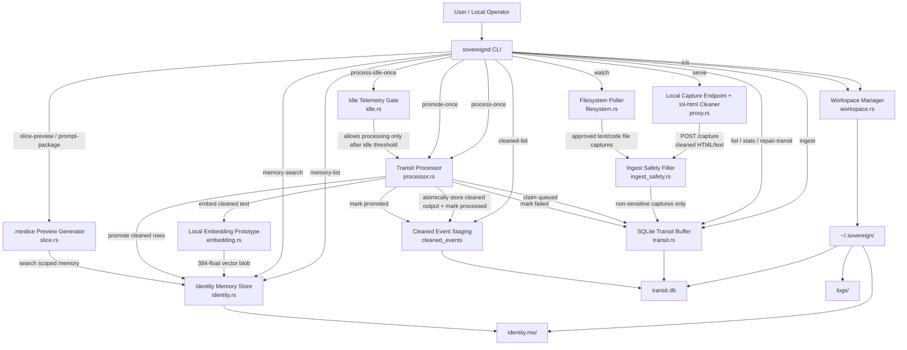

## 2. Intended Full-System Map

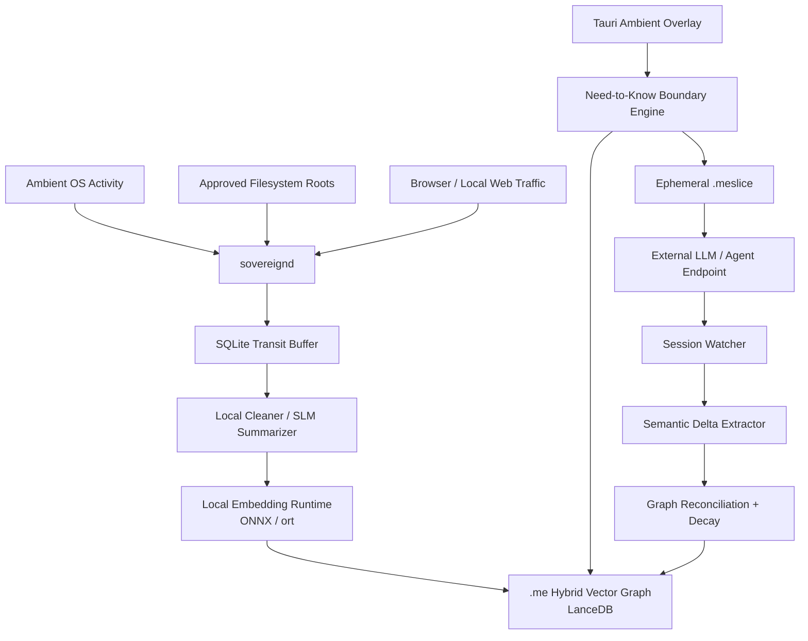

## 3. Ontology

| Entity | Type | Current Status | Code / Document | Responsibility |
| :--- | :--- | :--- | :--- | :--- |
| `sovereignd` | Daemon crate | Implemented | `crates/sovereignd` | Local ingestion and transit-buffer orchestration. |
| `Workspace Manager` | Module | Implemented | `crates/sovereignd/src/workspace.rs` | Creates local Sovereign directories. |
| `SQLite Transit Buffer` | Local store | Implemented | `crates/sovereignd/src/transit.rs` | Stores captured raw text, queue status, retry counts, and stale processing lease repair. |
| `Cleaned Event Staging` | Local store | Implemented | `crates/sovereignd/src/transit.rs` | Stores normalized text ready for future embedding. |
| `Ingest Safety Filter` | Privacy guard | Implemented | `crates/sovereignd/src/ingest_safety.rs` | Blocks secret-bearing paths, private keys, credential markers, card-like numbers, bank-routing markers, and precise-location markers before SQLite persistence. |
| `Local Embedding Prototype` | Compute stage | Implemented prototype | `crates/sovereignd/src/embedding.rs` | Generates deterministic local 384-dimensional embeddings for promoted cleaned text. This is a Phase 1 spike, not the final ONNX embedding runtime. |
| `Identity Memory Store` | Local store | Implemented prototype | `crates/sovereignd/src/identity.rs` | Stores local `.me` memory nodes plus fixed-width vector blobs in `identity.me/state.db`; searches with vector similarity plus lexical scoring. |
| `.meslice Preview Generator` | Privacy boundary | Implemented prototype | `crates/sovereignd/src/slice.rs` | Builds scoped context blocks and prompt packages from local memory search. |
| `Local Capture Endpoint` | Ingestion adapter | Implemented | `crates/sovereignd/src/proxy.rs`, `crates/sovereignd/src/main.rs` | Accepts local HTTP captures at `127.0.0.1:8080`; non-loopback binds are rejected unless explicitly forced for local development. |
| `HTML/Text Cleaner` | Capture normalizer | Implemented | `crates/sovereignd/src/proxy.rs`, `lol-html` | Extracts visible document text through a lightweight streaming parser and ignores script/style raw text before transit persistence. |
| `Filesystem Poller` | Ingestion adapter | Implemented fallback | `crates/sovereignd/src/filesystem.rs` | Polls approved folders for conservative text/code files on a blocking worker, reusing one SQLite writer per scan; OS-native watchers are still planned. |
| `Idle Telemetry Gate` | Resource guard | Implemented minimal | `crates/sovereignd/src/idle.rs` | Gates processing by recent user input on Windows and falls open where OS telemetry is unavailable. |
| `Transit Processor` | Pipeline worker | Implemented placeholder | `crates/sovereignd/src/processor.rs` | Claims queued captures and marks processing result. |
| `Tauri Overlay` | UI shell | Planned | `docs/engineering-roadmap.md` | Ambient command interface. |
| `.me Vector Graph` | Durable local state | Planned | `docs/local-vector-synthesis-architecture.md` | Stores hybrid document-vector-graph state. |
| `Local Embedding Runtime` | Compute stage | Implemented prototype / final runtime planned | `crates/sovereignd/src/embedding.rs`, `docs/local-vector-synthesis-architecture.md` | Current implementation is deterministic local hashing; final ONNX/ort embedding runtime remains planned. |
| `Boundary Engine` | Privacy gate | Planned | `docs/ephemeral-handshake-architecture.md` | Chooses minimum context needed for a task. |
| `.meslice` | Ephemeral payload | Planned | `docs/ephemeral-handshake-architecture.md` | Task-bound context stream for external agents. |
| `Session Watcher` | Feedback observer | Planned | `docs/bidirectional-state-synchronization-architecture.md` | Captures scoped outputs from agent sessions. |
| `Semantic Delta Extractor` | Feedback processor | Planned | `docs/bidirectional-state-synchronization-architecture.md` | Converts session logs into structured state deltas. |
| `Graph Reconciliation` | State merger | Planned | `docs/bidirectional-state-synchronization-architecture.md` | Merges deltas and decays outdated edges. |

## 4. Local Workspace Ontology

```text
~/.sovereign/
  identity.me/   implemented prototype memory store directory
    state.db     implemented SQLite `.me` staging ledger with vector blobs
  transit.db     implemented SQLite transit buffer and cleaned staging
  logs/          reserved local daemon logs
```

## 5. Implemented Command Surface

| Command | Pipeline | Inputs | Writes | Current Purpose |
| :--- | :--- | :--- | :--- | :--- |
| `init` | Workspace bootstrap | None | `~/.sovereign/*` | Creates local workspace and transit DB. |
| `ingest` | Manual capture | `--source`, `--content` | `captured_events` | Queues a text event manually. |
| `list` | Inspection | None | None | Lists recent captured events. |
| `stats` | Inspection | None | None | Counts events by status. |
| `repair-transit` | Transit repair | `--lease-ms` | `captured_events.status`, `captured_events.retry_count` | Requeues stale `processing` claims after a bounded lease timeout. |
| `cleaned-list` | Inspection | `--limit` | None | Lists normalized text staged for vectorization. |
| `memory-list` | Inspection | `--limit` | None | Lists local identity memory nodes. |
| `memory-search` | Local retrieval | `--query`, `--limit` | None | Searches memory nodes by deterministic token overlap. |
| `slice-preview` | Context boundary | `--intent`, `--limit` | None | Emits an ephemeral context block without raw memory IDs, hashes, or scores. |
| `prompt-package` | Context injection artifact | `--intent`, `--prompt`, `--limit` | None | Emits a local prompt package containing scoped context plus user task. |
| `serve` | Local proxy capture | `--addr`, `--allow-non-loopback` | `captured_events` | Runs `/health` and `/capture`; defaults to loopback-only binding. |
| `watch` | Filesystem capture | `--path`, `--non-recursive` | `captured_events` | Polls approved folders for text files. |
| `process-once` | Transit processing | `--limit` | `captured_events.status`, `cleaned_events` | Claims captures and stages normalized text. |
| `process-idle-once` | Idle-gated transit processing | `--limit`, `--idle-ms` | `captured_events.status`, `cleaned_events` when idle | Runs one processing batch only after the configured idle threshold. |
| `promote-once` | Memory promotion | `--limit` | `identity.me/state.db`, `cleaned_events.promoted_at_ms` | Promotes cleaned rows into local memory nodes. |

## 6. Transit Buffer State Machine

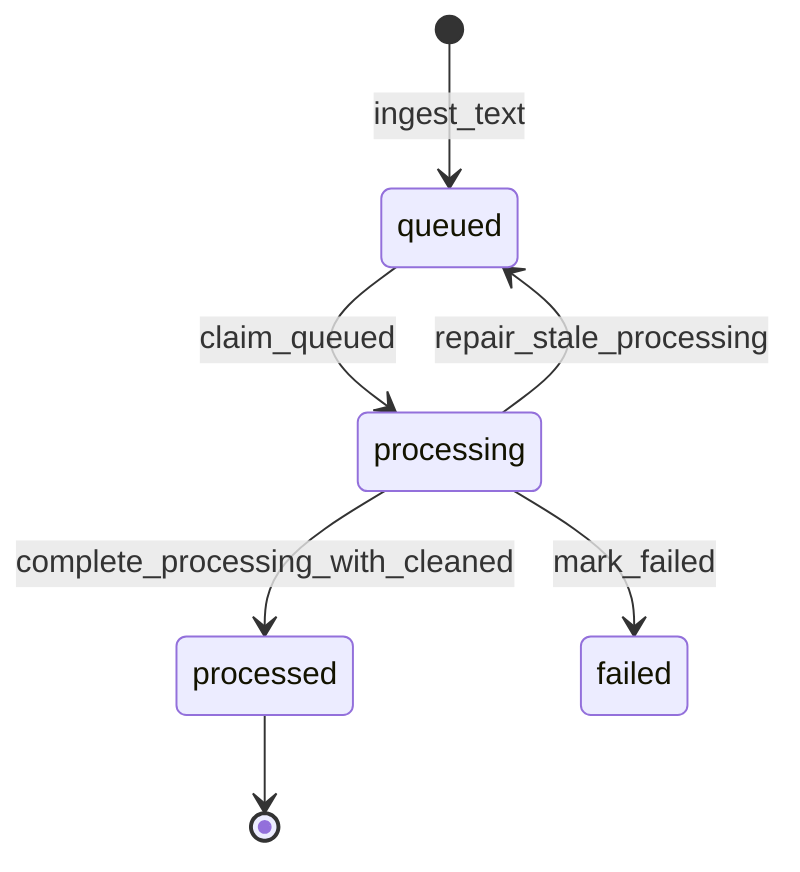

| State | Meaning | Written By |
| :--- | :--- | :--- |
| `queued` | Capture is stored and waiting for processing. | `ingest_text` |
| `processing` | Worker has claimed the event. | `claim_queued` |
| `processed` | Placeholder cleaner completed and cleaned staging was written in the same transaction. | `complete_processing_with_cleaned` |
| `failed` | Processing failed deterministically. | `mark_failed` |

`claim_queued` runs stale lease repair before claiming new work. Stale `processing`
rows are returned to `queued`, `retry_count` is incremented, and the row keeps an
error note recording the recovery event.

## 7. Implemented Ingestion Pipelines

### Manual Capture

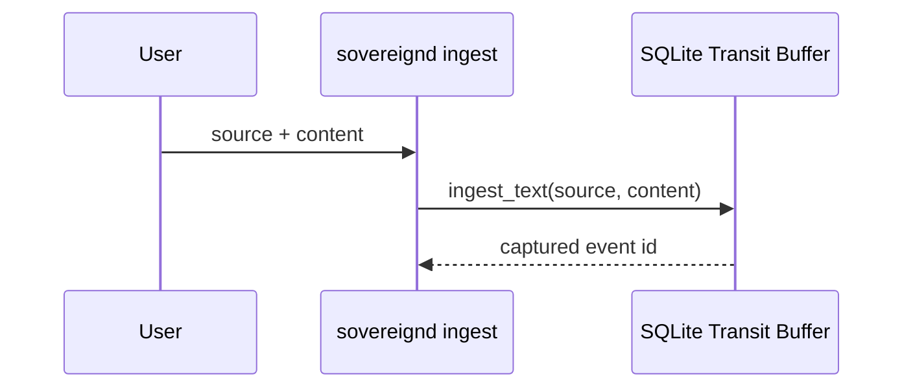

### Local HTTP Capture

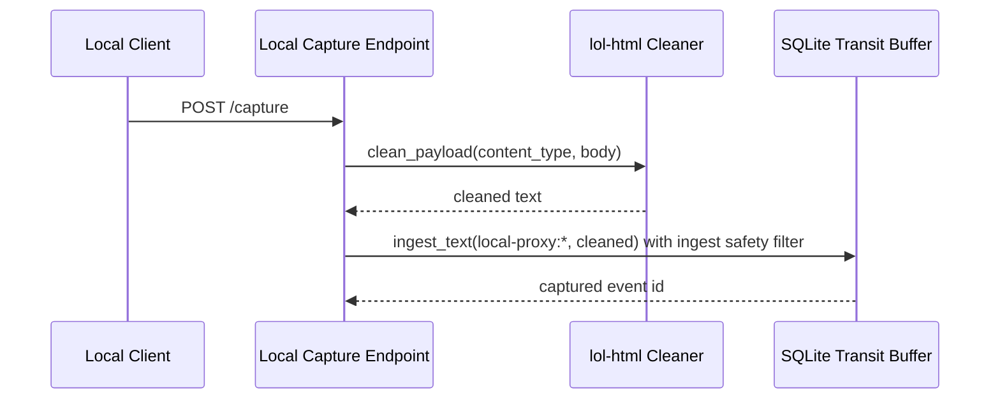

### Filesystem Capture

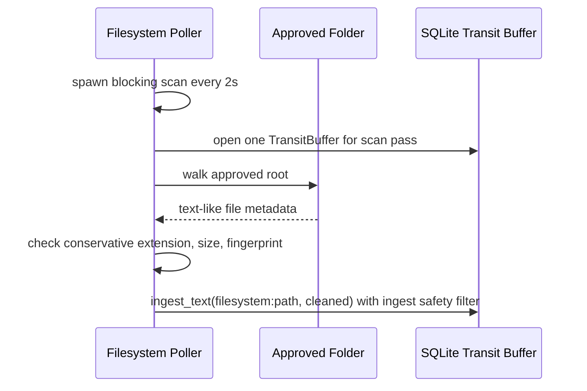

### Transit Processing

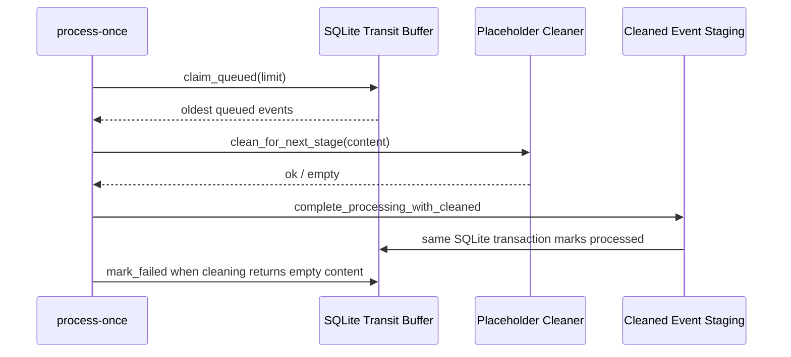

### Idle-Gated Transit Processing

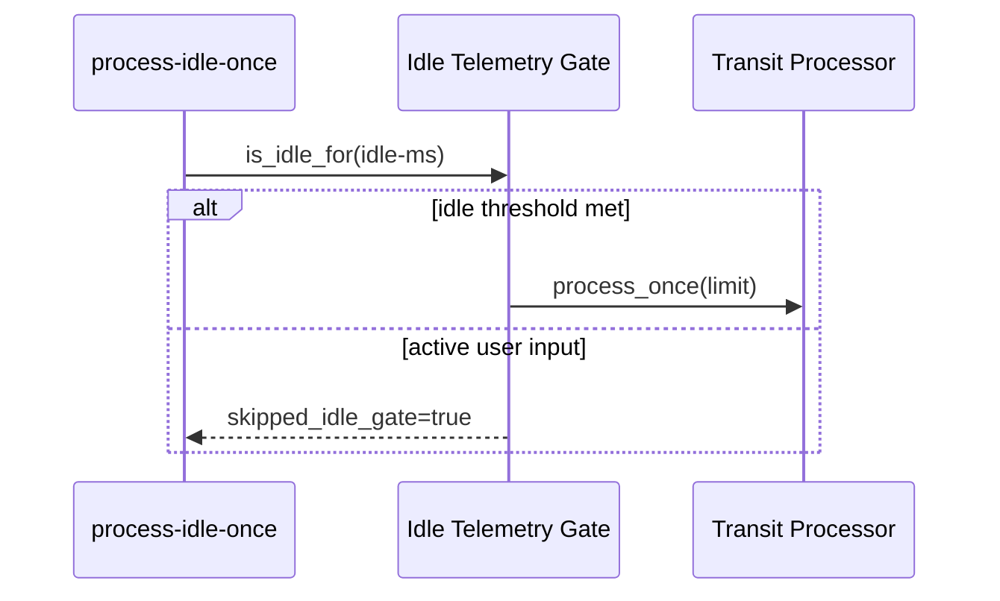

### Memory Promotion

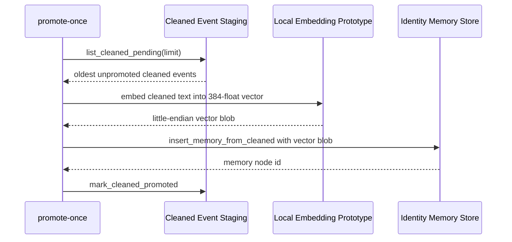

### Local Memory Retrieval

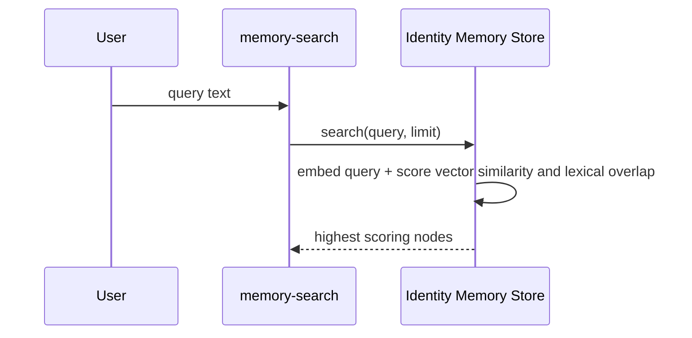

### Ephemeral Context Slice Preview

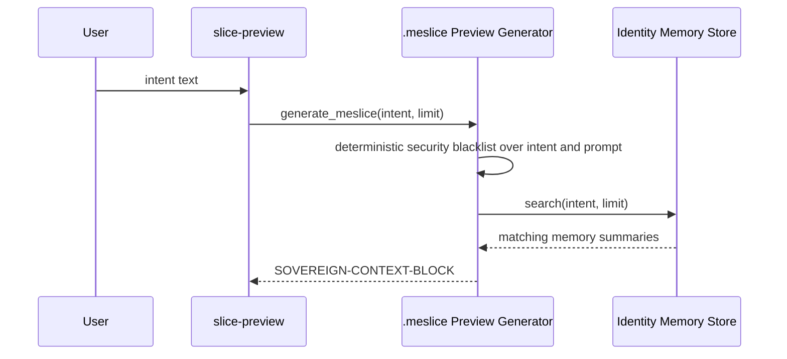

### Prompt Package Preview

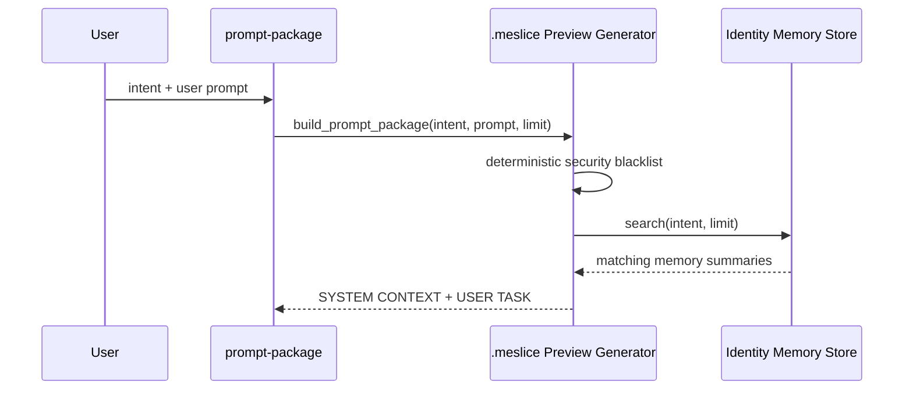

## 8. Planned Pipeline Boundaries

| Boundary | Upstream | Downstream | Rule |
| :--- | :--- | :--- | :--- |
| Capture to transit | Proxy / filesystem / manual | Ingest safety filter, then SQLite transit buffer | Reject deterministic sensitive material before any SQLite persistence. |
| Transit to cleaned staging | SQLite transit buffer | Transit processor | Process only claimed events; successful cleaned writes and `processed` status updates share one SQLite transaction. |
| Cleaned staging to `.me` prototype | `cleaned_events` | Local embedding prototype, then identity memory store | Promote normalized text into local memory nodes with fixed-width vector blobs. |
| `.me` prototype to retrieval | Identity memory store | Local query caller | Return vector/lexical ranked memory nodes. |
| `.me` prototype to `.meslice` preview | Identity memory store | `.meslice` generator | Export bounded declarative summaries only; no raw DB ids, hashes, sources, or scores. |
| `.meslice` preview to prompt package | `.meslice` generator | Local caller | Combine scoped context with user prompt without network transmission. |
| `.me` prototype to vectorization | `identity.me/state.db` | Local embedder | Embed memory nodes, not raw capture rows. |
| Vectorization to `.me` graph | Embedder | LanceDB graph | Write structured memories, not raw telemetry. |
| `.me` to `.meslice` | Boundary engine | External agent | Export minimum declarative facts only. |
| External execution to feedback | Agent endpoint | Session watcher | Capture only scoped task outputs. |
| Feedback to `.me` | Delta extractor | Graph reconciler | Validate deltas before merge. |

## 9. Maintenance Rules

When changing the system, update this file in the same pass if any of the following change:

- A new crate, module, command, or local store is added.
- A pipeline gains or loses a stage.
- A state transition changes.
- A new external boundary appears.
- A planned component becomes implemented.
- A dependency changes the architecture or performance budget.

Keep this map factual. Mark future components as `Planned`; do not imply they are implemented before code exists.
