# Identity System Map

This is the living ontology for the Identity system.

It must be updated whenever a coding pass adds, removes, or materially changes a module, data store, pipeline stage, state transition, external boundary, or command.

## 1. Current Runtime Map

```mermaid
flowchart TD
    User["User / Local Operator"]
    CLI["identityd CLI"]
    Workspace["Workspace Manager\nworkspace.rs"]
    Transit["SQLite Transit Buffer\ntransit.rs"]
    Cleaned["Cleaned Event Staging\ncleaned_events"]
    EmbedProto["Local Embedding Prototype\nembedding.rs"]
    Tokenizer["Local WordPiece Tokenizer\nvocab.txt -> tensors"]
    Memory["Identity Memory Store\nidentity.rs"]
    MemoryGraph["Prototype Memory Graph Edges\ngraph_edges"]
    VectorStore["Vector Blob Store\nfilesystem default\nLanceDB opt-in"]
    MemoryMeta["Memory Metadata\nstore_metadata"]
    Slice[".meslice Preview Generator\nslice.rs"]
    Delta["Explicit Agent Delta Boundary\ndelta.rs"]
    BrowserPage["Explicit Browser/Page Capture Helper\nbrowser_capture.rs"]
    Proxy["Local Capture Endpoint + lol-html Cleaner\nproxy.rs"]
    FS["Filesystem Watcher\nfilesystem.rs"]
    Safety["Ingest Safety Filter\ningest_safety.rs"]
    Crypto["Local Content Protection\ncrypto.rs"]
    Processor["Transit Processor\nprocessor.rs"]
    Idle["Idle Telemetry Gate\nidle.rs"]
    Redaction["Transit Content Redaction\npost-promotion minimization"]
    Resources["Resource Budget Probe\nresource.rs"]
    LocalRoot["~/.identity/"]
    IdentityDir["identity.me/"]
    TransitDb["transit.db"]
    CaptureToken["capture.token"]
    Logs["logs/"]

    User --> CLI
    CLI --> Workspace
    Workspace --> LocalRoot
    LocalRoot --> IdentityDir
    LocalRoot --> TransitDb
    LocalRoot --> CaptureToken
    LocalRoot --> Logs

    CLI -->|"init"| Workspace
    CLI -->|"ingest"| Transit
    CLI -->|"capture-active-window"| Safety
    CLI -->|"capture-page / browser-capture-bookmarklet"| BrowserPage
    CLI -->|"watch-active-window"| Safety
    CLI -->|"list / stats / capture-sources / doctor / repair-transit"| Transit
    CLI -->|"doctor"| Resources
    CLI -->|"protect-at-rest"| Crypto
    CLI -->|"redact-transit-content"| Redaction
    CLI -->|"cleaned-list"| Cleaned
    CLI -->|"memory-list"| Memory
    CLI -->|"memory-stats / memory-export / memory-protocol-health / repair-protocol-schema / repair-memory-vectors"| Memory
    CLI -->|"embedding-runtime-health / embedding-active-health / onnx-runtime-health / embedding-tokenizer-health / embedding-tokenize / embedding-onnx-run / embedding-manifest-write / embedding-bootstrap"| EmbedProto
    CLI -->|"memory-search"| Memory
    CLI -->|"memory-edge-* / memory-graph-health"| MemoryGraph
    CLI -->|"slice-preview / prompt-package"| Slice
    CLI -->|"agent-delta-preview / agent-delta-commit"| Delta
    CLI -->|"serve"| Proxy
    CLI -->|"watch"| FS
    CLI -->|"daemon"| Proxy
    CLI -->|"daemon"| Processor
    CLI -->|"daemon --watch-path"| FS
    CLI -->|"daemon --watch-active-window"| Safety
    CLI -->|"process-once"| Processor
    CLI -->|"process-idle-once"| Idle
    CLI -->|"pipeline-once / pipeline-loop"| Processor
    CLI -->|"promote-once"| Processor

    CaptureToken -->|"X-Identity-Capture-Token"| Proxy
    BrowserPage -->|"selected text + title/url\nloopback POST /capture"| Proxy
    Proxy -->|"authorized POST /capture\ncleaned HTML/text"| Safety
    FS -->|"approved text/code file captures"| Safety
    Safety -->|"non-sensitive captures only"| Crypto
    Crypto -->|"protected capture text\n+ source labels"| Transit
    Processor -->|"claim queued"| Transit
    Idle -->|"allows processing only after idle threshold"| Processor
    Processor -->|"Unicode NFKC normalize + strip control chars\n+ mark processed"| Cleaned
    Processor -->|"mark failed"| Transit
    Processor -->|"decrypt local cleaned text\nthen embed"| EmbedProto
    EmbedProto -->|"WordPiece token tensors"| Tokenizer
    Tokenizer -->|"input_ids / attention_mask / token_type_ids"| EmbedProto
    EmbedProto -->|"ONNX opt-in or hash fallback\n384-float vector blob"| Memory
    Memory -->|"similarity/manual links"| MemoryGraph
    Memory -->|"mirror vector blobs"| VectorStore
    Processor -->|"promote protected\nsemantic text"| Memory
    Processor -->|"mark promoted"| Cleaned
    Processor -->|"redact promoted transit duplicates"| Redaction
    Redaction -->|"clear captured/cleaned content after .me write"| Transit
    Redaction --> Cleaned
    Memory --> MemoryMeta
    Slice -->|"search scoped memory"| Memory
    Delta -->|"validated outcome candidate"| Safety
    Delta -->|"commit explicit agent outcome"| Memory
    MemoryGraph --> IdentityDir
    Transit --> TransitDb
    Cleaned --> TransitDb
    Memory --> IdentityDir
```

## 2. Intended Full-System Map

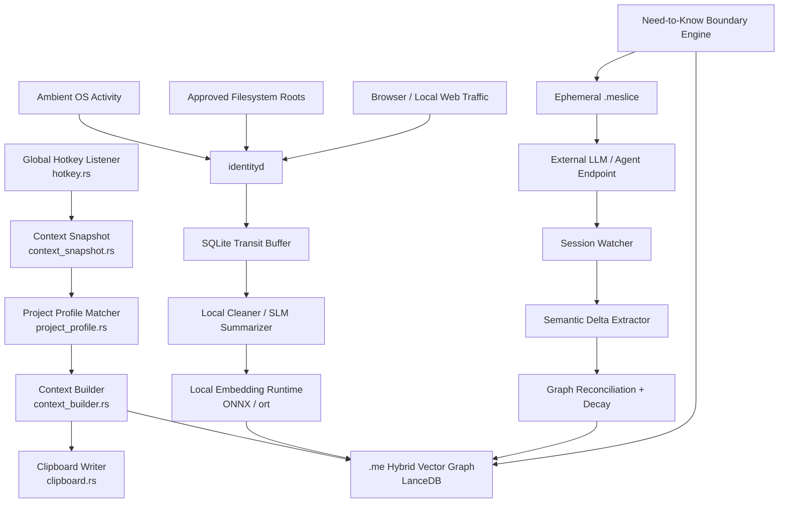

## 3. Ontology

| Entity | Type | Current Status | Code / Document | Responsibility |
| :--- | :--- | :--- | :--- | :--- |
| `identityd` | Daemon crate | Implemented | `crates/identityd` | Local ingestion and transit-buffer orchestration. |
| `Workspace Manager` | Module | Implemented | `crates/identityd/src/workspace.rs` | Creates local Identity directories and a stable local `capture.token` used to authorize loopback capture writes. |
| `Capture Adapter Health` | Module | Implemented | `crates/identityd/src/capture.rs` | Centralizes read-only Phase 1 capture-adapter health for `doctor`, reporting manual ingest, token-protected loopback capture, safe-root filesystem capture, minimal active-window capture, and the conservative aggregate capture status. |
| `SQLite Transit Buffer` | Local store | Implemented | `crates/identityd/src/transit.rs` | Stores captured text temporarily, queue status, retry counts, stale processing lease repair, claimed-state enforcement for processing completion, redaction timestamps, protected source-family health counts, transit health reporting, and rollback-only insert latency probes. |
| `Cleaned Event Staging` | Local store | Implemented | `crates/identityd/src/transit.rs` | Stores normalized text ready for future embedding; promoted rows are redacted after insertion into local memory. |
| `Transit Content Redaction` | Privacy guard | Implemented | `crates/identityd/src/transit.rs`, `crates/identityd/src/processor.rs` | Clears duplicate captured and cleaned content after successful promotion into `.me` prototype storage while preserving hashes, timestamps, and pipeline state. |
| `Resource Budget Probe` | Resource guard | Implemented | `crates/identityd/src/resource.rs`, `crates/identityd/src/main.rs` | Reports current process working-set/pagefile memory on Windows, binary size, and budget status through `doctor` without adding a measurement dependency. |
| `Ingest Safety Filter` | Privacy guard | Implemented | `crates/identityd/src/ingest_safety.rs` | Enforces a universal 1MB capture-content budget and 2048-byte source-label budget, then blocks secret-bearing paths, SSH/AWS/Azure/GPG config roots, private keys, credential markers, known secret token prefixes, sensitive browser `Page URL:` values, card-like numbers including spaced/dashed variants, bank-routing markers, and precise-location markers before SQLite persistence. |
| `Local Content Protection` | Privacy guard | Implemented on Windows | `crates/identityd/src/crypto.rs`, `crates/identityd/src/transit.rs`, `crates/identityd/src/identity.rs`, `crates/identityd/src/main.rs` | Protects captured text, source labels, cleaned staging text, and prototype `.me` semantic text fields before SQLite persistence. On Windows this uses the local user's DPAPI boundary; legacy plaintext rows remain readable for development migration compatibility. `doctor` reports legacy plaintext field counts and `protect-at-rest` migrates them locally. Cross-platform OS-backed backends remain future hardening work. |
| `ONNX Artifact Bootstrap` | Bootstrap tool | Implemented | `crates/identityd/src/bootstrap.rs` | Downloads the all-MiniLM-L6-v2 ONNX model and WordPiece vocabulary from Hugging Face using the system `curl.exe`, writes the adjacent `.identity.json` manifest, and prints environment variable configuration guidance. Requires no additional Rust dependencies. |
| `Local Embedding Prototype` | Compute stage | Implemented prototype with explicit runtime boundary | `crates/identityd/src/embedding.rs` | Generates deterministic local 384-dimensional embeddings for promoted cleaned text, exposes model/runtime metadata, preflights a configured `IDENTITY_EMBEDDING_MODEL_PATH` for local `.onnx` artifact existence/type/size plus an adjacent `<model>.onnx.identity.json` manifest with the expected embedding dimension, can write that sidecar through `embedding-manifest-write`, can validate and run local WordPiece tokenization through `embedding-tokenizer-health` and `embedding-tokenize`, can attempt a read-only ONNX Runtime session load through `onnx-runtime-health`, can execute an explicit local ONNX embedding smoke path through `embedding-onnx-run` when built with `--features onnx-runtime`, and reports local embedding latency against the 200ms map-stage budget through `doctor`. The live `EmbeddingEngine` now selects a stable runtime/model id at store-open time: hash remains default, `IDENTITY_EMBEDDING_RUNTIME=onnx` may select the manifest model id when the local runtime is healthy, and unavailable ONNX falls back to hash. |
| `Identity Memory Store` | Local store | Implemented prototype | `crates/identityd/src/identity.rs` | Stores local `.me` memory nodes plus fixed-width vector blobs in `identity.me/state.db`; assigns each node a stable UUIDv4-style `node_uid`, UTC ISO8601 `created_at_utc`, and UTC ISO8601 `last_accessed_utc` while keeping compact SQLite row ids and millisecond timestamps for local joins and ordering; updates last-access metadata when retrieval returns a node; exports recent nodes as local protocol-shaped JSON using `node_uid` and target edge `node_uid` values rather than internal row ids; validates protocol-facing UUIDs, UTC timestamps, parseable JSON-object structured attributes, and active vector dimensions through `doctor` and `memory-protocol-health`; repairs bounded protocol-field drift through `repair-protocol-schema`; now separates memory-domain derivation from the concrete SQLite persistence backend and routes vector encode/decode/similarity decisions through a local embedding-engine boundary to keep the promotion and retrieval surface stable ahead of later ONNX and vector-store swaps; persists the selected embedding model id/runtime separately from structural schema migration, lets empty stores adopt the active runtime, and keeps non-empty hash-backed stores on hash until an explicit re-embedding migration exists; checks `cleaned_event_id` duplicates before embedding/vector writes, mirrors promoted vector blobs into the reserved local vector-store root, checks the primary mirror directly instead of masking misses through SQLite fallback reads, backfills that mirror from valid SQLite vectors on open, and can fall back to SQLite when primary vector blobs are missing or corrupt during retrieval; classifies promoted captures by source type such as filesystem, local web capture, Windows UI activity, and explicit agent outcome deltas; derives structured summaries and lightweight JSON attributes for Windows activity captures from application, window, focus, and visible-text fields, for explicit browser/page captures from page title and URL, and for explicit agent outcome deltas from outcome state, delta source, summary, entities, review categories, and extracted delta attributes; searches with vector similarity plus lexical scoring; exposes bounded recent web-capture lookup for inspection, a narrower recent selected-page lookup for browser/agent context fallback, and a bounded recent agent-delta JSON export that omits raw text, hashes, vectors, scores, and internal row ids while falling back to `{}` for malformed structured attributes; reports and repairs vector health; stores prototype graph edges between memory nodes. |
| `Prototype Memory Graph Edges` | Local store table | Implemented prototype | `crates/identityd/src/identity.rs` | Stores bounded weighted edges in `graph_edges`, rejects invalid/self edges, uses SQLite foreign-key checks, auto-links nearby vectors during memory promotion, exposes manual edge commands, reports graph health including agent-delta node, outcome-edge, conflict-edge, and supersession-edge counts, applies explicit edge-weight decay, and automatically decays older agent-delta outgoing non-supersession edges when a newer same-entity delta supersedes them. This is local graph scaffolding inside the SQLite `.me` prototype, not final LanceDB graph completion. |
| `Vector Blob Store` | Local store | Implemented lean default | `crates/identityd/src/vector_store.rs` | Persists fixed-width vector blobs under `identity.me/vectors`, writes local store metadata, exposes primary-only reads for mirror health, and uses SQLite inline vector blobs as fallback. The default build uses this filesystem+SQLite backend to keep the daemon small. The LanceDB/Arrow backend remains available behind `--features lancedb-backend` for explicit vector-store experiments. |
| `Memory Metadata` | Local store table | Implemented prototype | `crates/identityd/src/identity.rs` | Persists current embedding model id and embedding dimension for local `.me` schema inspection. |
| `.meslice Preview Generator` | Privacy boundary | Implemented prototype | `crates/identityd/src/slice.rs` | Builds scoped context blocks and prompt packages from local memory search. |
| `Explicit Agent Delta Boundary` | Feedback primitive | Implemented prototype | `crates/identityd/src/delta.rs`, `crates/identityd/src/main.rs`, `crates/identityd/src/identity.rs` | Provides `agent-delta-preview` and `agent-delta-commit` for user-provided agent outcome text or reviewed candidate JSON. The boundary normalizes prose sources as bounded lowercase slugs under `agent-delta:`, applies the shared ingest safety filter plus outbound security blacklist, extracts or parses a bounded deterministic candidate with schema version, outcome state, summary, obvious entities, key/value attributes, `requires_review`, and review-required categories, rejects unknown candidate JSON fields, validates the candidate against the local delta schema and safety gates before JSON preview or memory commit, and commits only that candidate into `.me` memory when explicitly requested. Finance, health, legal identity, and private-communication markers require `--allow-sensitive` before commit, and repeated identical deltas dedupe through a stable negative cleaned-event id before embedding/vector writes. Committed deltas use concise source-specific summary tokens, structured attributes for outcome/source/summary/entities/review categories/delta attributes, and a bounded same-entity graph reconciliation transaction that links outcomes to recent matching local memories with `OUTCOME_FOR` / `UPDATED_BY` edges, links newer matching deltas to older deltas with `SUPERSEDES` / `SUPERSEDED_BY`, adds `ATTRIBUTE_CONFLICTS_WITH` / `ATTRIBUTE_REPLACED_BY` edges when same-key attributes change, and decays the older delta's outgoing non-supersession edges using the documented edge-decay formula. This is Phase 3 scaffolding for write-back; it is not an ambient session watcher or browser/API observer. |
| `Explicit Browser/Page Capture Helper` | Ingestion adapter | Implemented | `crates/identityd/src/browser_capture.rs`, `crates/identityd/src/main.rs` | Provides `capture-page` for CLI-friendly selected page text capture, `capture-page --from-clipboard` for local clipboard-envelope capture, `browser-capture-clipboard-bookmarklet` for a no-token selected-text clipboard bridge, and `browser-capture-bookmarklet` for direct selected-text loopback posting. The helper formats optional title and http/https URL plus explicit selected text, drops non-web page URL schemes, strips URL query strings and fragments before persistence, preflights the shared safety filter, reads the workspace capture token locally, and posts to the loopback `/capture` endpoint. It is opt-in and user-triggered, not ambient DOM surveillance. |
| `Local Capture Endpoint` | Ingestion adapter | Implemented | `crates/identityd/src/proxy.rs`, `crates/identityd/src/main.rs` | Accepts local HTTP captures at `127.0.0.1:8080` only when `X-Identity-Capture-Token` matches the workspace-local `capture.token`; answers CORS preflight for bookmarklet use while keeping actual writes token-gated; caps headers at 16KB and uses the shared 1MB ingest safety capture budget; accepts only textual content types; non-loopback binds are rejected unless explicitly forced for local development. |
| `HTML/Text Cleaner` | Capture normalizer | Implemented | `crates/identityd/src/proxy.rs`, `lol-html` | Extracts visible document text through a lightweight streaming parser and ignores script/style raw text before transit persistence. |
| `Active Window Capture` | Ingestion adapter | Implemented cross-platform | `crates/identityd/src/activity.rs`, `crates/identityd/src/main.rs` | Captures the current foreground window title and executable name on Windows, macOS, and Linux. Windows deep UI Automation/MSAA focused-control and visible child-window text extraction is guarded behind `IDENTITYD_ENABLE_DEEP_ACTIVE_WINDOW_TEXT=1` because those raw native paths can crash host processes when launched hidden; the default daemon stays on the stable metadata path. AppleScript on macOS and X11 utility queries on Linux provide metadata capture. One-shot and bounded watch modes are both available. |
| `Filesystem Watcher` | Ingestion adapter | Implemented | `crates/identityd/src/filesystem.rs` | Uses `ReadDirectoryChangesW` on Windows, falls back to polling with `--poll`, validates watch roots before startup, refuses broad/sensitive roots unless `--allow-unsafe-watch-root` is explicitly passed, exposes this policy through `doctor`, filters text-like files by extension (25 supported extensions including code, config, and data formats), checks first 512 bytes for null bytes to skip binary files with text extensions, treats invalid UTF-8 as non-text, retries transient Windows file locks, reads up to 1MB per file, and dedupes burst events by per-path content hash. |
| `Idle Telemetry Gate` | Resource guard | Implemented minimal | `crates/identityd/src/idle.rs` | Gates processing by recent user input on Windows (`GetLastInputInfo`) and falls open where OS telemetry is unavailable. |
| `Transit Processor` | Pipeline worker | Implemented | `crates/identityd/src/processor.rs` | Claims queued captures, stages cleaned output through Unicode NFKC normalization with control-character stripping, promotes cleaned rows into local memory, and runs idle-gated pipeline cycles. The daemon pipeline loop is resilient to transient errors: it logs and retries rather than crashing. |
| `Context Snapshot` | Context capture module | Implemented (Phase 2) | `crates/identityd/src/context_snapshot.rs` | Reads active foreground window metadata (process name, title, focused-control text, optional selected text) on demand without queuing a transit capture. Reuses existing `activity.rs` native Windows calls. |
| `Project Profile Matcher` | Deterministic classifier | Implemented (Phase 2) | `crates/identityd/src/project_profile.rs`, `~/.identity/projects.json` | Loads JSON/TOML project profiles, matches the active context snapshot against window title, process name, and path substrings, and returns project guardrails and memory query terms. No ML required. |
| `Context Builder` | Context formatter | Implemented (Phase 2) | `crates/identityd/src/context_builder.rs` | Combines context snapshot, matched project profile, memory search results, and a bounded recent selected-page fallback for known browser process names or explicit agent-chat title markers into a structured, sanitized `[IDENTITY CONTEXT]` block. Active project profiles contribute their memory query terms without suppressing the current window-title memory query. The fallback only uses explicit page captures with `Selected page text:` metadata from the last 24 hours, not arbitrary loopback web captures or stale page selections. Applies deterministic freshness/source-diversity ranking over candidate facts, collapsing repeated foreground-window title memories, capping selected-page fallback, preventing a single source domain from filling every slot on the first pass when another eligible domain exists, relaxing that domain cap only to avoid leaving otherwise usable slots empty, and packing shorter later facts when a candidate does not fit the remaining character budget so project/profile facts, relevant memory hits, and eligible recent selected-page context can share the bounded budget. Enforces char/token budget (default 8000 chars). Strips internal IDs, hashes, and scores. Sanitizes focused text to prevent prompt injection. |
| `Clipboard Writer` | Output adapter | Implemented (Phase 2) | `crates/identityd/src/clipboard.rs` | Writes a UTF-16 string to the Windows clipboard using native `OpenClipboard`/`SetClipboardData`/`CloseClipboard` API calls. No GUI framework dependency. |
| `Hotkey Listener` | Input adapter | Implemented (Phase 2) | `crates/identityd/src/hotkey.rs` | Registers a global system hotkey via Win32 `RegisterHotKey`, also polls `GetAsyncKeyState` as a lightweight fallback when message delivery is unreliable, fires the context injection pipeline on press, logs trigger-path errors, debounces rapid repeats, and runs only when `--hotkey` flag is passed. Does not block the daemon ingestion pipeline. |
| `Tauri Overlay` | UI shell | Deferred | `docs/engineering-roadmap.md` | Optional future visual overlay. Not required for V0 clipboard-first hotkey injection. |
| `.me Vector Graph` | Durable local state | Implemented lean prototype | `crates/identityd/src/identity.rs`, `docs/local-vector-synthesis-architecture.md` | Durable local memory graph is implemented in SQLite with filesystem vector blobs by default. Embedded LanceDB remains an opt-in backend behind `--features lancedb-backend`, not part of the default daemon binary. |
| `Local Embedding Runtime` | Compute stage | Opt-in ONNX attempt / default hash fallback | `crates/identityd/src/embedding.rs`, `docs/local-vector-synthesis-architecture.md` | Current default implementation is deterministic local hashing. The optional `onnx-runtime` Cargo feature adds `ort` with default features disabled and dynamic loading, validates low-thread ONNX session loading, and can run an explicit local embedding inference smoke path from WordPiece tensors to a normalized 384-dimensional vector. `IDENTITY_EMBEDDING_RUNTIME=onnx` lets the live engine attempt ONNX during promotion/search while preserving hash fallback for local pipeline continuity. |
| `Boundary Engine` | Privacy gate | Planned | `docs/ephemeral-handshake-architecture.md` | Chooses minimum context needed for a task. |
| `.meslice` | Ephemeral payload | Planned | `docs/ephemeral-handshake-architecture.md` | Task-bound context stream for external agents. |
| `Session Watcher` | Feedback observer | Planned | `docs/bidirectional-state-synchronization-architecture.md` | Captures scoped outputs from agent sessions. |
| `Semantic Delta Extractor` | Feedback processor | Planned | `docs/bidirectional-state-synchronization-architecture.md` | Converts session logs into structured state deltas. |
| `Graph Reconciliation` | State merger | Planned | `docs/bidirectional-state-synchronization-architecture.md` | Merges deltas and decays outdated edges. |

## 4. Local Workspace Ontology

```text
~/.identity/
  identity.me/   implemented prototype memory store directory
    state.db     implemented SQLite `.me` staging ledger with vector blobs
            memory_nodes
                node_uid               UUIDv4-style protocol-facing memory id
                created_at_utc         UTC ISO8601 protocol creation timestamp
                last_accessed_utc      UTC ISO8601 protocol retrieval timestamp
                structured_attributes  lightweight JSON capture facets for direct local lookup
      store_metadata
      graph_edges
        vectors/     default filesystem-backed vector blob store and reserved future embedded vector DB root
            store.meta
            node-*.f32le
            lancedb/  optional when built with the `lancedb-backend` feature
  transit.db     implemented SQLite transit buffer and cleaned staging
    captured_events.content_redacted_at_ms
    cleaned_events.content_redacted_at_ms
  capture.token  local loopback capture write token
  logs/          reserved local daemon logs
```

## 5. Local Workspace Additions (Phase 2)

```text
~/.identity/
  projects.json   optional deterministic project profile config
                  matches window title / process / path to project id
                  contains per-project memory query terms and guardrails
```

## 6. Implemented Command Surface

Global `--root <folder>` can be used before a command to run against an explicit Identity workspace root, which keeps tests and development runs out of the real `~/.identity` ledger.

| Command | Pipeline | Inputs | Writes | Current Purpose |
| :--- | :--- | :--- | :--- | :--- |
| `init` | Workspace bootstrap | None | `~/.identity/*`, `capture.token` | Creates local workspace, capture token, and transit DB. |
| `ingest` | Manual capture | `--source`, `--content` | `captured_events` | Queues a text event manually. |
| `capture-active-window` | Windows activity capture | None | `captured_events` | Captures the current foreground window title and application name into the local transit buffer on Windows. Deep UI Automation/MSAA focused-control and visible UI text capture is opt-in with `IDENTITYD_ENABLE_DEEP_ACTIVE_WINDOW_TEXT=1`. |
| `capture-page` | Explicit browser/page capture | `--title`, `--url`, `--text` or `--stdin` or `--from-clipboard`, optional `--dry-run`, `--promote-now`, `--addr` | `captured_events` through `/capture` unless `--dry-run` is used; optional exact capture promotion with `--promote-now` | Formats user-selected page text with optional title and http/https URL, drops non-web URL schemes, strips query strings and fragments from the page URL, requires an `IDENTITY-PAGE-CAPTURE` clipboard envelope when `--from-clipboard` is used, validates the payload against the shared safety blacklist, reads the workspace capture token, and posts to the loopback capture endpoint. `--promote-now` processes and promotes only the just-queued capture id so selected page context can be used immediately without draining unrelated transit backlog. Refuses non-loopback targets. |
| `browser-capture-bookmarklet` | Explicit browser/page helper generation | Optional `--addr` | None | Prints a bookmarklet that prompts for the capture token and sends only `window.getSelection()` plus page title and URL to `/capture`. Refuses non-loopback targets. |
| `browser-capture-clipboard-bookmarklet` | Explicit browser/page helper generation | None | Clipboard only when the user runs the bookmarklet | Prints a no-token bookmarklet that copies only `window.getSelection()` plus page title and URL into an `IDENTITY-PAGE-CAPTURE` clipboard envelope. The local `capture-page --from-clipboard` command performs token-authorized loopback capture afterward. |
| `watch-active-window` | Windows activity watch | `--interval-ms` | `captured_events` | Polls the foreground window at a bounded interval and queues captures only when the application or title changes. |
| `list` | Inspection | None | None | Lists recent captured events. |
| `stats` | Inspection | None | None | Counts events by status. |
| `capture-sources` | Inspection | None | None | Prints protected capture source-family counts for manual, loopback, filesystem, active-window, and other local ingress without exposing raw paths or source labels. |
| `doctor` | Phase 1 health inspection | `--lease-ms` | Rollback-only SQLite probe, embedding latency probe, resource budget probe | Prints workspace paths, transit health, stale processing count, protected capture source-family counts, memory vector health, primary vector mirror health, memory `node_uid`, creation timestamp, last-access timestamp, protocol export schema health, embedding model/runtime/artifact/manifest metadata, ONNX Runtime session health, tokenizer vocabulary health, centralized capture adapter health, filesystem watch-root policy metadata, workspace startup readiness timing, local transit insert latency budget status, embedding map-stage latency budget status, process memory budget status, binary-size budget status, content-protection backend, unprotected legacy field counts, explicit Phase 1 readiness markers including `phase1_embedding_artifact`, a `phase1_foundation_completion_percent` score, the next concrete Phase 1 milestone, and remaining blockers for final Phase 1 completion. |
| `repair-transit` | Transit repair | `--lease-ms` | `captured_events.status`, `captured_events.retry_count` | Requeues stale `processing` claims after a bounded lease timeout. |
| `protect-at-rest` | Privacy repair | `--limit` | `captured_events.source`, `captured_events.content`, `cleaned_events.source`, `cleaned_events.cleaned_content`, memory semantic text fields | Converts legacy plaintext development rows into the current protected-at-rest format without changing local API output. |
| `redact-transit-content` | Data minimization | `--limit` | `captured_events.content`, `cleaned_events.cleaned_content`, redaction timestamps | Clears duplicate content from promoted transit rows after `.me` storage succeeds. |
| `cleaned-list` | Inspection | `--limit` | None | Lists normalized text staged for vectorization. |
| `memory-list` | Inspection | `--limit` | None | Lists local identity memory nodes, including internal row ids, protocol-facing `node_uid` values, created UTC timestamps, and last-accessed UTC timestamps. |
| `memory-stats` | Inspection | None | None | Prints `.me` prototype node count, protocol id/timestamp health counts, SQLite vector health, primary vector mirror counts, embedding model id, embedding dimension, and embedding runtime metadata. |
| `embedding-runtime-health` | Inspection | None | None | Prints embedding runtime metadata plus local ONNX artifact and sidecar-manifest preflight status from `IDENTITY_EMBEDDING_MODEL_PATH` without loading a model. |
| `embedding-active-health` | Inspection | Optional `IDENTITY_EMBEDDING_RUNTIME=onnx` plus ONNX model/vocab/runtime environment | None | Prints the requested embedding runtime, active runtime, and fallback reason used by the live `EmbeddingEngine` for promotion/search. |
| `onnx-runtime-health` | Inspection | `IDENTITY_EMBEDDING_MODEL_PATH`, optional native ONNX Runtime dynamic library environment | None | Prints whether the daemon was compiled with the optional `onnx-runtime` feature, whether a runtime dynamic-library path is configured, and whether the ready `.onnx` artifact can be opened as a low-thread ONNX Runtime session. |
| `embedding-tokenizer-health` | Inspection | Optional `--vocab-path`, otherwise `IDENTITY_TOKENIZER_VOCAB_PATH` | None | Validates a local WordPiece vocabulary file size, readability, token count, and required `[PAD]`, `[UNK]`, `[CLS]`, and `[SEP]` tokens. |
| `embedding-tokenize` | Local tensor preparation | `--text`, optional `--vocab-path`, optional `--max-tokens` | None | Runs dependency-free local WordPiece tokenization and prints padded `input_ids`, `attention_mask`, and `token_type_ids` for BERT/MiniLM-style ONNX embedding models. |
| `embedding-onnx-run` | Feature-gated local embedding inference | `--text`, optional `--model-path`, optional `--vocab-path`, optional `--max-tokens`; requires `--features onnx-runtime` and configured ONNX Runtime dynamic library | None | Tokenizes local text, runs the local ONNX model with `input_ids`, `attention_mask`, and optional `token_type_ids`, extracts the first `f32` output tensor, pools it into the persisted 384-dimensional vector contract, normalizes the vector, and prints compact run metadata. |
| `embedding-manifest-write` | Local embedding artifact setup | `--model-path`, `--model-id`, optional `--force` | `<model>.onnx.identity.json` | Writes the local sidecar manifest expected by ONNX artifact preflight after validating that the artifact exists, is a non-empty file, and has an `.onnx` extension; refuses to overwrite an existing sidecar unless `--force` is passed, then prints artifact readiness fields. |
| `embedding-bootstrap` | ONNX model bootstrap | optional `--model-dir` | `model.onnx`, `vocab.txt`, `<model>.onnx.identity.json` | Downloads the all-MiniLM-L6-v2 ONNX model (~23MB) and WordPiece vocabulary from Hugging Face using the system `curl.exe`, writes the adjacent manifest, and prints environment variable guidance for enabling the ONNX embedding runtime. Skips existing files. |
| `memory-export` | Local protocol inspection | `--limit` | None | Prints recent `.me` prototype nodes as protocol-shaped JSON with `node_id`, protocol timestamps, semantic payload, vector floats, and graph edges addressed by target `node_uid`; internal SQLite row ids and cleaned-event ids are omitted. |
| `memory-protocol-health` | Local protocol inspection | None | None | Prints protocol-facing readiness counts for UUIDv4-style node ids, UTC timestamps, parseable JSON-object structured attributes, and active vector dimensions. |
| `repair-protocol-schema` | Memory repair | `--limit` | `identity.me/state.db.memory_nodes`, `identity.me/vectors/node-*.f32le` | Repairs bounded protocol-facing drift by regenerating invalid UUIDv4-style node ids, backfilling UTC timestamps from local millisecond epochs, normalizing malformed structured attributes to `{}`, and rebuilding wrong-sized vectors from protected local raw text. |
| `repair-memory-vectors` | Memory repair | `--limit` | `identity.me/state.db.memory_nodes.vector_embedding` | Rebuilds missing or corrupt vector blobs locally from stored raw text. |
| `memory-search` | Local retrieval | `--query`, `--limit` | `identity.me/state.db.memory_nodes.last_accessed_*` | Searches memory nodes by vector similarity plus lexical overlap and marks returned nodes as accessed. |
| `memory-edge-add` | Memory graph mutation | `--source-id`, `--target-id`, `--relationship`, `--weight` | `identity.me/state.db.graph_edges` | Adds or updates a bounded weighted relationship between two persisted memory nodes. |
| `memory-edges-list` | Memory graph inspection | `--limit` | None | Lists recent prototype graph edges. |
| `memory-edge-decay` | Memory graph decay | `--limit` | `identity.me/state.db.graph_edges` | Applies the documented edge-weight decay formula to recent graph edges. |
| `memory-graph-health` | Memory graph inspection | None | None | Prints node, agent-delta node, edge, orphan, outcome-edge, conflict-edge, supersession-edge, and decayed-edge counts for the prototype graph. |
| `slice-preview` | Context boundary | `--intent`, `--limit` | None | Emits an ephemeral context block without raw memory IDs, hashes, or scores. |
| `prompt-package` | Context injection artifact | `--intent`, `--prompt`, `--limit` | None | Emits a local prompt package containing scoped context plus user task. |
| `agent-delta-list` | Explicit feedback inspection | `--limit`, optional `--review-only`, optional `--source`, optional `--entity`, optional `--state` | None | Emits recent committed agent deltas as bounded JSON with protocol-facing node ids, UTC timestamps, source, top-level outcome state, extracted entities, extracted delta attributes, summary, top-level review flags/categories, and structured attributes. It can filter to review-required deltas with `--review-only`, to one normalized `agent-delta:` source with `--source`, to one extracted entity with `--entity`, and to one normalized outcome state with `--state`, omits raw text, hashes, vector blobs, scores, and internal SQLite row ids, and clamps requested limits and filtered scans to 100 rows. |
| `agent-delta-preview` | Explicit feedback candidate extraction | `--text` or `--content` or `--stdin`, optional `--source`, or `--candidate-json` / `--candidate-json-stdin` | None | Extracts a bounded deterministic agent outcome candidate from user-provided text after shared ingest safety and outbound security blacklist checks, or validates a reviewed candidate JSON object without writing. Validates the candidate schema, rejects unknown JSON fields, then prints JSON only, including `schema_version`, `requires_review`, and review-required categories. |
| `agent-delta-commit` | Explicit feedback write-back | `--text` or `--content` or `--stdin`, optional `--source`, or `--candidate-json` / `--candidate-json-stdin`; optional `--allow-sensitive`, optional `--json` | `identity.me/state.db`, `identity.me/vectors/node-*.f32le`, `identity.me/state.db.graph_edges` | Extracts or parses the same schema-validated agent outcome candidate and commits it through the existing `.me` memory insertion path under `agent.outcome/AGENT_DELTA`. Sensitive review categories fail closed unless `--allow-sensitive` is passed, duplicate retries reuse the same stable local delta id before embedding/vector writes, the command reports the protocol-facing node id rather than the internal SQLite row id, prints `write_status=created` or `write_status=existing`, can emit the same bounded commit result as JSON with `--json`, and bounded same-entity graph reconciliation links the outcome to existing local context, marks changed same-key attributes, and decays superseded older outcome edges. This is user-triggered write-back, not ambient session watching. |
| `serve` | Local proxy capture | `--addr`, `--allow-non-loopback`, `X-Identity-Capture-Token` for writes | `captured_events` | Runs `/health` and token-authorized `/capture`; defaults to loopback-only binding and returns bounded HTTP errors for invalid or oversized captures. |
| `watch` | Filesystem capture | `--path`, `--non-recursive`, `--poll`, `--allow-unsafe-watch-root` | `captured_events` | Uses Windows filesystem events by default on Windows and keeps polling as an explicit fallback. Validates the root against the safe-root policy and dedupes repeated same-content events per path. |
| `start` | Default local context daemon preset | Optional `--paste-on-hotkey`, `--hotkey-combo` | `captured_events`, `cleaned_events`, `identity.me/state.db`, active-window captures, clipboard writes | Runs the daemon with bounded foreground-window metadata capture and the global `Ctrl+Shift+I` hotkey enabled by default. Copies the current compact context block to the clipboard on hotkey press; pasting remains opt-in. `start-identity-hidden.cmd` launches this preset hidden, and `scripts/test-identity-hotkey.ps1` verifies hidden startup, `/health`, simulated hotkey input, and clipboard output. |
| `daemon` | Phase 1/2 local daemon orchestration | `--addr`, `--process-limit`, `--promote-limit`, `--idle-ms`, `--interval-ms`, optional `--watch-path`, `--watch-active-window`, `--activity-interval-ms`, `--non-recursive`, `--allow-non-loopback`, `--allow-unsafe-watch-root`, `--hotkey`, `--hotkey-combo`, `--paste-on-hotkey` | `captured_events`, `cleaned_events`, `identity.me/state.db`, optional filesystem and OS activity captures, optional clipboard writes | Runs the loopback capture endpoint and idle-gated clean/promote pipeline together in one process. Startup binds the loopback endpoint before reporting the hotkey as ready, and restarts internal daemon tasks if they stop unexpectedly. Optional `--watch-path` adds a shutdown-aware filesystem watcher after safe-root validation; optional `--watch-active-window` adds bounded foreground-window capture. `--hotkey` registers a global system hotkey and copies generated context to clipboard on each press, with optional Ctrl+V pasting. Active-window watcher failures in daemon mode are logged and retried instead of terminating the daemon. On Windows, terminal close or OS process termination stops the daemon instead of relying on a local Ctrl+C signal future that can be tripped by stale console events. |
| `context-now` | Phase 2 on-demand context generation | `--preview`, `--copy`, optional `--project <name>`, `--limit` | Clipboard (when `--copy`) | Implemented. Generates a compact sanitized `[IDENTITY CONTEXT]` block from the active window, an auto-matched or explicitly named local project profile, and `.me` memory, prints it (with `--preview`) or copies it to clipboard (with `--copy`). Unknown explicit project names fail closed with a clear error. |
| `project-profile-list` | Phase 2 project profile inspection | None | None | Implemented. Lists known project profiles loaded from `~/.identity/projects.json` and reports which profile matches the current active window. |
| `process-once` | Transit processing | `--limit` | `captured_events.status`, `cleaned_events` | Claims captures and stages normalized text. |
| `process-idle-once` | Idle-gated transit processing | `--limit`, `--idle-ms` | `captured_events.status`, `cleaned_events` when idle | Runs one processing batch only after the configured idle threshold. |
| `pipeline-once` | Idle-gated local state pipeline | `--process-limit`, `--promote-limit`, `--idle-ms` | `captured_events.status`, `cleaned_events`, `identity.me/state.db`, redaction timestamps when idle | Runs one local clean/promote/redact cycle under the idle gate. |
| `pipeline-loop` | Repeating local state pipeline | `--process-limit`, `--promote-limit`, `--idle-ms`, `--interval-ms` | `captured_events.status`, `cleaned_events`, `identity.me/state.db`, redaction timestamps when idle | Repeats local clean/promote/redact cycles at a bounded interval. |
| `promote-once` | Memory promotion | `--limit` | `identity.me/state.db`, `cleaned_events.promoted_at_ms`, redaction timestamps | Promotes cleaned rows into local memory nodes, then redacts duplicate transit content. |

Operational self-tests live under `scripts/`. `test-identity-hotkey.ps1` is the
canonical hidden daemon and hotkey smoke test. `test-identity-page-capture.ps1`
is the focused explicit page-capture smoke test: it starts `serve` on an
ephemeral loopback port against a temporary workspace, copies an
`IDENTITY-PAGE-CAPTURE` envelope after first verifying plain clipboard text is
rejected by `capture-page --from-clipboard`, runs `capture-page --from-clipboard
--promote-now`, verifies local memory search can retrieve the promoted selected
page capture, verifies `context-now --preview --project tfl-central` includes
that selected page context while the test terminal has a browser/agent-like
title, restores the clipboard/window title, and removes the temporary workspace.

## 6. Transit Buffer State Machine

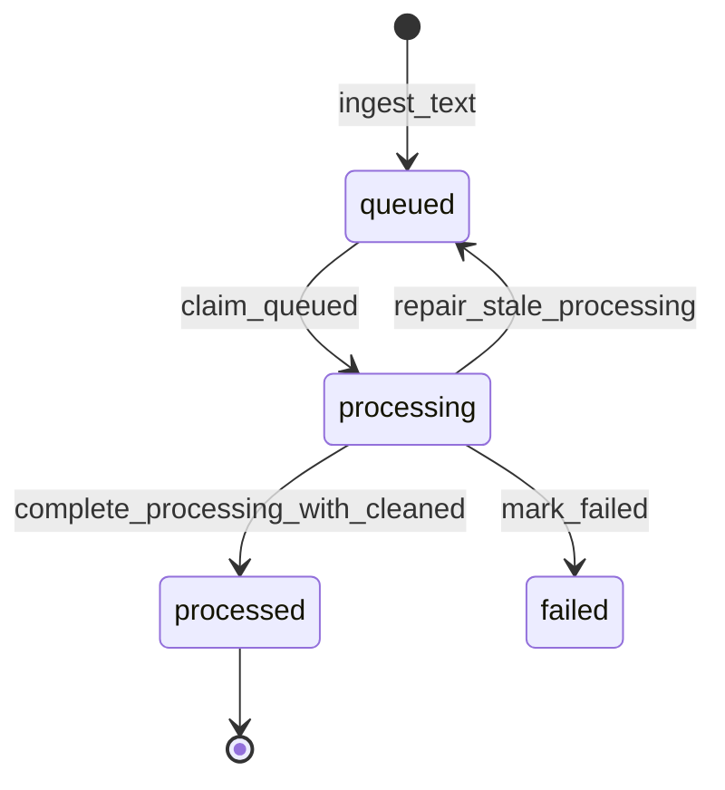

| State | Meaning | Written By |
| :--- | :--- | :--- |
| `queued` | Capture is stored and waiting for processing. | `ingest_text` |
| `processing` | Worker has claimed the event. | `claim_queued` |
| `processed` | Placeholder cleaner completed and cleaned staging was written in the same transaction. | `complete_processing_with_cleaned` |
| `failed` | Processing failed deterministically. | `mark_failed` |

`claim_queued` runs stale lease repair before claiming new work. Stale `processing`
rows are returned to `queued`, `retry_count` is incremented, and the row keeps an
error note recording the recovery event.

## 7. Implemented Ingestion Pipelines

### Manual Capture


### Local HTTP Capture

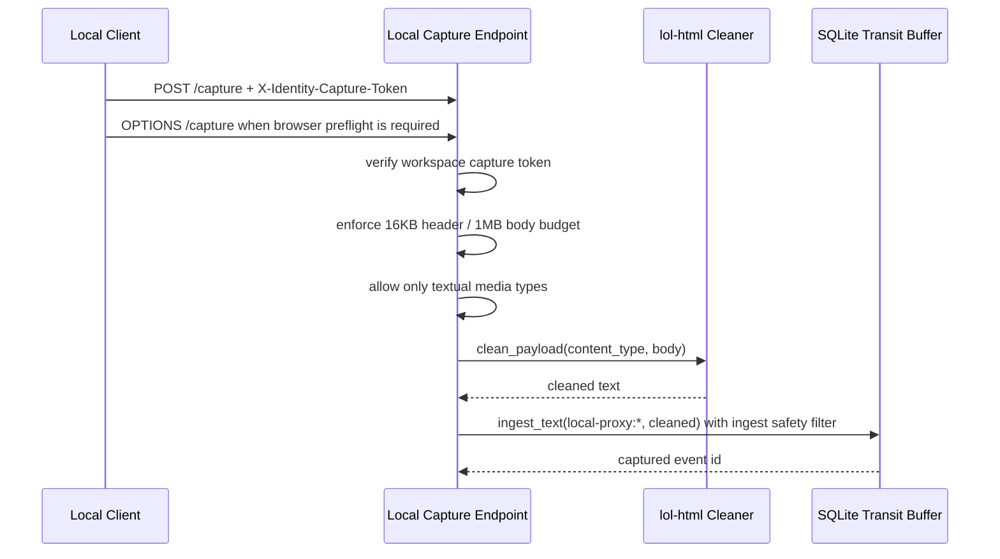

### Explicit Browser/Page Capture

```mermaid
sequenceDiagram
    participant User
    participant Bookmarklet as Clipboard Bookmarklet
    participant Helper as capture-page
    participant Proxy as Local Capture Endpoint
    participant Safety as Ingest Safety Filter
    participant Transit as SQLite Transit Buffer

    User->>Bookmarklet: select page text
    Bookmarklet-->>User: clipboard envelope with title/url/selection
    User->>Helper: capture-page --from-clipboard
    Helper->>Helper: format Page title / Page URL / Selected page text
    Helper->>Helper: require explicit non-empty selection; CLI path preflights safety
    Helper->>Proxy: POST /capture + X-Identity-Capture-Token
    Proxy->>Proxy: token + media-type + body-budget checks
    Proxy->>Safety: validate_capture(local-proxy:*, cleaned)
    Safety-->>Proxy: accepted or deterministic privacy block
    Proxy->>Transit: ingest accepted selected page text
    Transit-->>Proxy: captured event id
    opt --promote-now
        Helper->>Transit: claim just-captured event id
        Helper->>Transit: store cleaned selected page text
        Helper->>Transit: promote matching cleaned row to .me memory
    end
```

### Filesystem Capture

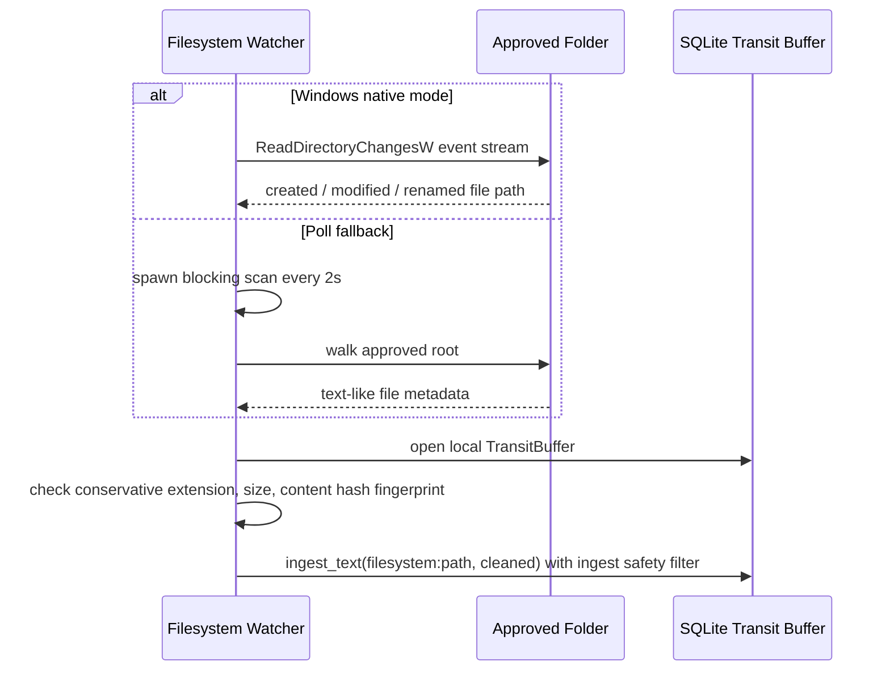

### Transit Processing

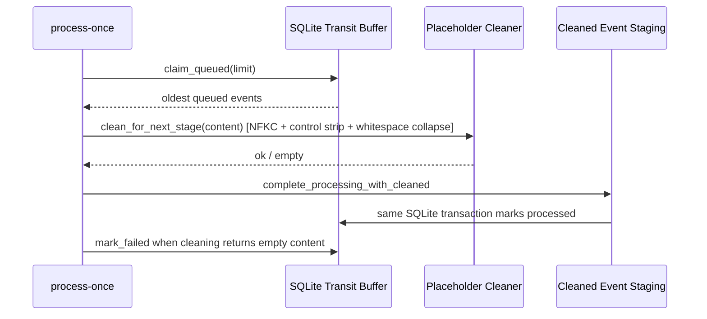

### Idle-Gated Transit Processing

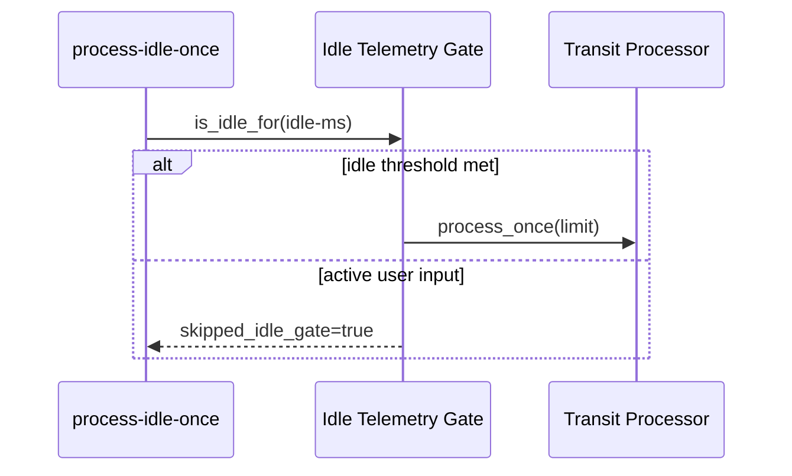

### Idle-Gated Local Pipeline

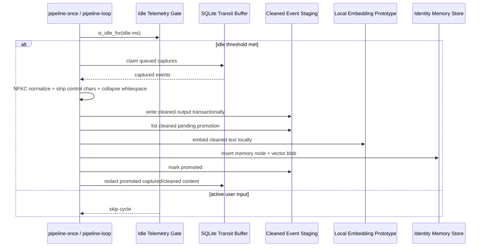

### Memory Promotion

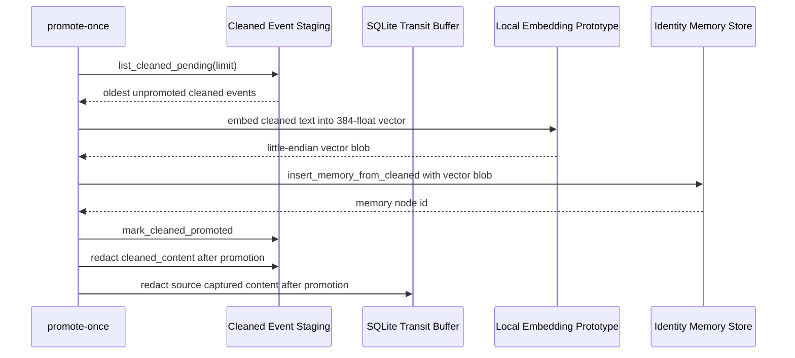

### Local Memory Retrieval

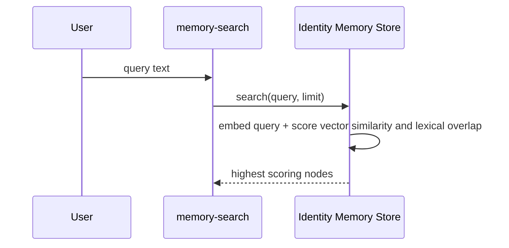

### Memory Vector Health

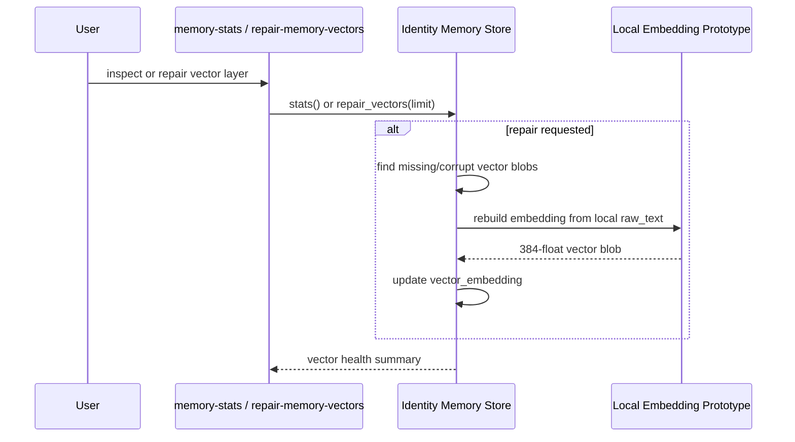

### Phase 1 Doctor

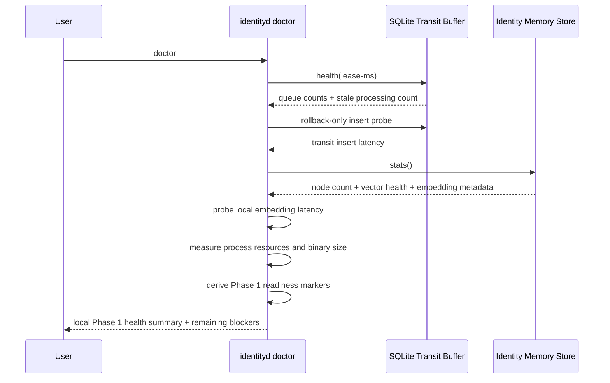

### Ephemeral Context Slice Preview

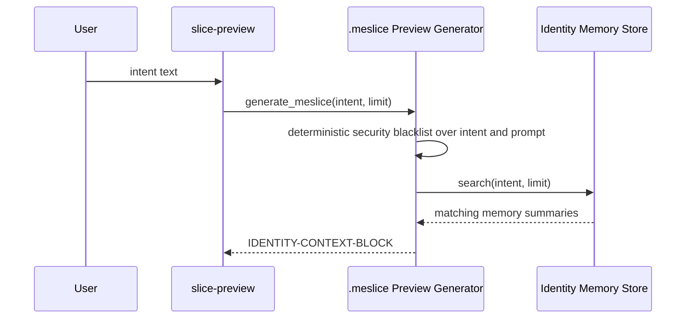

### Prompt Package Preview

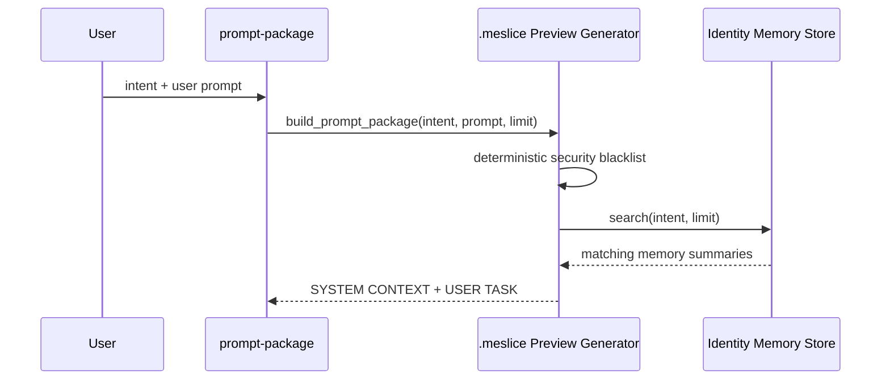

### Hotkey Context Injection (Implemented Phase 2)

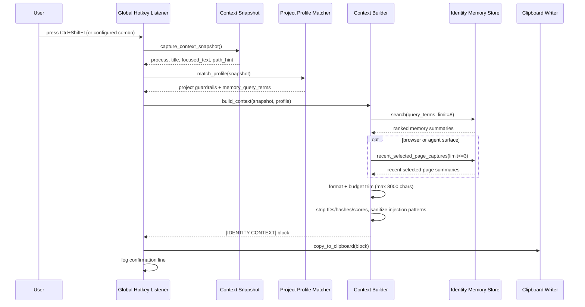

## 8. Planned Pipeline Boundaries

| Boundary | Upstream | Downstream | Rule |
| :--- | :--- | :--- | :--- |
| Capture to transit | Proxy / explicit browser-page helper / filesystem / manual / active-window | Ingest safety filter, local content protection, then SQLite transit buffer | Enforce shared source/content budgets, reject deterministic sensitive paths, credential markers, known token prefixes, sensitive browser page URLs, private keys, payment-card-like numbers, routing markers, and precise-location markers, then protect accepted text before SQLite persistence. |
| Transit to cleaned staging | SQLite transit buffer | Transit processor | Process only claimed events; successful cleaned writes and `processed` status updates share one SQLite transaction, and completion is rejected unless the capture is still in `processing`. |
| Cleaned staging to `.me` prototype | `cleaned_events` | Local embedding prototype, local content protection, then identity memory store | Decrypt locally for embedding, promote normalized text into local memory nodes with fixed-width vector blobs, protect semantic text fields at rest, then redact duplicate transit content. |
| Promoted transit to redacted transit | `captured_events`, `cleaned_events` | Transit redaction routine | Keep queue state, hashes, promotion markers, and redaction timestamps; clear duplicate content after `.me` insertion. |
| Idle gate to local state pipeline | Idle telemetry gate | Transit processor and memory promotion | Skip local synthesis/promotion while the user is active. |
| `.me` prototype to retrieval | Identity memory store | Local query caller | Return vector/lexical ranked memory nodes, plus bounded recent selected-page `local.web.capture` rows for browser/agent context fallback when explicitly requested by the context builder; the context builder only auto-injects selected-page fallback rows created within the last 24 hours, then applies local freshness/source-diversity ranking before formatting facts. |
| `.me` prototype to vector health | Identity memory store | Local CLI caller | Expose model metadata and repair missing/corrupt vector blobs locally. |
| `.me` prototype to `.meslice` preview | Identity memory store | `.meslice` generator | Export bounded declarative summaries only; no raw DB ids, hashes, sources, or scores. |
| `.meslice` preview to prompt package | `.meslice` generator | Local caller | Combine scoped context with user prompt without network transmission. |
| `.me` prototype to vectorization | `identity.me/state.db` | Local embedder | Embed memory nodes, not raw capture rows. |
| Vectorization to `.me` graph | Embedder | LanceDB graph | Write structured memories, not raw telemetry. |
| `.me` to `.meslice` | Boundary engine | External agent | Export minimum declarative facts only. |
| External execution to feedback | Agent endpoint | Session watcher | Capture only scoped task outputs. |
| Feedback to `.me` | Delta extractor | Graph reconciler | Validate deltas before merge. |
| Explicit agent outcome to `.me` | User-triggered `agent-delta-preview` / `agent-delta-commit` | Shared safety filter, outbound security blacklist, deterministic delta extractor or strict candidate-JSON parser, delta schema validator, sensitive-category review gate, identity memory store, bounded graph reconciliation | Preview emits or validates a bounded schema-versioned candidate without writing. Commit stores only the validated candidate through the existing local embedding/vector/protection path under `agent.outcome/AGENT_DELTA`, requires `--allow-sensitive` for sensitive review categories, dedupes identical retries through the stable delta id before vectorization, reports created versus existing writes, links same-entity outcomes to recent local memory graph nodes, records changed same-key attributes as explicit conflict/replacement graph edges, and decays older superseded outcome evidence without deleting history. This does not observe sessions automatically. |
| Hotkey to clipboard | Hotkey listener | Context snapshot → project profile → context builder → clipboard writer | Read active window on demand, match project profile, search memory, format sanitized block, write to clipboard only. Never auto-submit. Never expose raw DB internals. |
| Browser/page selection to transit | User-triggered `capture-page`, clipboard bookmarklet, or direct loopback bookmarklet | Token-protected loopback `/capture` endpoint | Prefer the clipboard envelope: browser code copies selected text/title/URL only, then local `capture-page --from-clipboard` requires that envelope, reads the workspace token, and posts to `/capture`. Plain clipboard text must use `--stdin` or `--text`. Direct bookmarklet posting remains token-gated. Never run ambient DOM surveillance, full-page scraping, browser automation runtimes, or headless browsers. |
| Recent selected-page context fallback | Context builder | Clipboard context block | Include up to three selected-page memory summaries created within the last 24 hours only when the active surface matches a known browser process name or explicit agent-chat title marker, after query/profile search results and under the same deterministic dedupe, source-diversity, and fact-budget rules; when non-page facts are available, selected-page fallback leaves at least one fact slot for them. |

## 9. Maintenance Rules

When changing the system, update this file in the same pass if any of the following change:

- A new crate, module, command, or local store is added.
- A pipeline gains or loses a stage.
- A state transition changes.
- A new external boundary appears.
- A planned component becomes implemented.
- A dependency changes the architecture or performance budget.

Keep this map factual. Mark future components as `Planned`; do not imply they are implemented before code exists.
