# Identity System Map

This is the living ontology for the Identity system.

It must be updated whenever a coding pass adds, removes, or materially changes a module, data store, pipeline stage, state transition, external boundary, or command.

## 1. Current Runtime Map

```mermaid
flowchart TD
    User["User / Local Operator"]
    CLI["identityd CLI"]
    Workspace["Workspace Manager\nworkspace.rs"]
    Transit["SQLite Transit Buffer\ntransit.rs"]
    Cleaned["Cleaned Event Staging\ncleaned_events"]
    EmbedProto["Local Embedding Prototype\nembedding.rs"]
    Memory["Identity Memory Store\nidentity.rs"]
    VectorStore["Filesystem Vector Store\nvector_store.rs"]
    MemoryMeta["Memory Metadata\nstore_metadata"]
    Slice[".meslice Preview Generator\nslice.rs"]
    Proxy["Local Capture Endpoint + lol-html Cleaner\nproxy.rs"]
    FS["Filesystem Watcher\nfilesystem.rs"]
    Safety["Ingest Safety Filter\ningest_safety.rs"]
    Processor["Transit Processor\nprocessor.rs"]
    Idle["Idle Telemetry Gate\nidle.rs"]
    Redaction["Transit Content Redaction\npost-promotion minimization"]
    LocalRoot["~/.identity/"]
    IdentityDir["identity.me/"]
    TransitDb["transit.db"]
    Logs["logs/"]

    User --> CLI
    CLI --> Workspace
    Workspace --> LocalRoot
    LocalRoot --> IdentityDir
    LocalRoot --> TransitDb
    LocalRoot --> Logs

    CLI -->|"init"| Workspace
    CLI -->|"ingest"| Transit
    CLI -->|"capture-active-window"| Safety
    CLI -->|"watch-active-window"| Safety
    CLI -->|"list / stats / doctor / repair-transit"| Transit
    CLI -->|"redact-transit-content"| Redaction
    CLI -->|"cleaned-list"| Cleaned
    CLI -->|"memory-list"| Memory
    CLI -->|"memory-stats / repair-memory-vectors"| Memory
    CLI -->|"memory-search"| Memory
    CLI -->|"slice-preview / prompt-package"| Slice
    CLI -->|"serve"| Proxy
    CLI -->|"watch"| FS
    CLI -->|"daemon"| Proxy
    CLI -->|"daemon"| Processor
    CLI -->|"daemon --watch-path"| FS
    CLI -->|"daemon --watch-active-window"| Safety
    CLI -->|"process-once"| Processor
    CLI -->|"process-idle-once"| Idle
    CLI -->|"pipeline-once / pipeline-loop"| Processor
    CLI -->|"promote-once"| Processor

    Proxy -->|"POST /capture\ncleaned HTML/text"| Safety
    FS -->|"approved text/code file captures"| Safety
    Safety -->|"non-sensitive captures only"| Transit
    Processor -->|"claim queued"| Transit
    Idle -->|"allows processing only after idle threshold"| Processor
    Processor -->|"atomically store cleaned output + mark processed"| Cleaned
    Processor -->|"mark failed"| Transit
    Processor -->|"embed cleaned text"| EmbedProto
    EmbedProto -->|"384-float vector blob"| Memory
    Memory -->|"mirror vector blobs"| VectorStore
    Processor -->|"promote cleaned rows"| Memory
    Processor -->|"mark promoted"| Cleaned
    Processor -->|"redact promoted transit duplicates"| Redaction
    Redaction -->|"clear captured/cleaned content after .me write"| Transit
    Redaction --> Cleaned
    Memory --> MemoryMeta
    Slice -->|"search scoped memory"| Memory
    Transit --> TransitDb
    Cleaned --> TransitDb
    Memory --> IdentityDir
```

## 2. Intended Full-System Map


## 3. Ontology

| Entity | Type | Current Status | Code / Document | Responsibility |
| :--- | :--- | :--- | :--- | :--- |
| `identityd` | Daemon crate | Implemented | `crates/identityd` | Local ingestion and transit-buffer orchestration. |
| `Workspace Manager` | Module | Implemented | `crates/identityd/src/workspace.rs` | Creates local Identity directories. |
| `SQLite Transit Buffer` | Local store | Implemented | `crates/identityd/src/transit.rs` | Stores captured text temporarily, queue status, retry counts, stale processing lease repair, redaction timestamps, and transit health reporting. |
| `Cleaned Event Staging` | Local store | Implemented | `crates/identityd/src/transit.rs` | Stores normalized text ready for future embedding; promoted rows are redacted after insertion into local memory. |
| `Transit Content Redaction` | Privacy guard | Implemented | `crates/identityd/src/transit.rs`, `crates/identityd/src/processor.rs` | Clears duplicate captured and cleaned content after successful promotion into `.me` prototype storage while preserving hashes, timestamps, and pipeline state. |
| `Ingest Safety Filter` | Privacy guard | Implemented | `crates/identityd/src/ingest_safety.rs` | Blocks secret-bearing paths, private keys, credential markers, card-like numbers, bank-routing markers, and precise-location markers before SQLite persistence. |
| `Local Embedding Prototype` | Compute stage | Implemented prototype | `crates/identityd/src/embedding.rs` | Generates deterministic local 384-dimensional embeddings for promoted cleaned text and exposes model metadata. This is a Phase 1 spike, not the final ONNX embedding runtime. |
| `Identity Memory Store` | Local store | Implemented prototype | `crates/identityd/src/identity.rs` | Stores local `.me` memory nodes plus fixed-width vector blobs in `identity.me/state.db`; now separates memory-domain derivation from the concrete SQLite persistence backend and routes vector encode/decode/similarity decisions through a local embedding-engine boundary to keep the promotion and retrieval surface stable ahead of later ONNX and vector-store swaps; mirrors promoted vector blobs into the reserved local vector-store root, backfills that mirror from valid SQLite vectors on open, and can fall back to that store when SQLite vector blobs are missing or corrupt; classifies promoted captures by source type such as filesystem, local web capture, and Windows UI activity; derives structured summaries and lightweight JSON attributes for Windows activity captures from application, window, focus, and visible-text fields; searches with vector similarity plus lexical scoring; reports and repairs vector health. |
| `Filesystem Vector Store` | Local store | Implemented prototype | `crates/identityd/src/vector_store.rs` | Persists fixed-width vector blobs under `identity.me/vectors`, writes local store metadata, and now serves as the primary implementation behind a small vector-blob backend boundary. Retrieval falls through to a second SQLite-backed implementation that reads inline vector blobs from `identity.me/state.db`, making the backend seam concrete ahead of later embedded vector-database work. |
| `Memory Metadata` | Local store table | Implemented prototype | `crates/identityd/src/identity.rs` | Persists current embedding model id and embedding dimension for local `.me` schema inspection. |
| `.meslice Preview Generator` | Privacy boundary | Implemented prototype | `crates/identityd/src/slice.rs` | Builds scoped context blocks and prompt packages from local memory search. |
| `Local Capture Endpoint` | Ingestion adapter | Implemented | `crates/identityd/src/proxy.rs`, `crates/identityd/src/main.rs` | Accepts local HTTP captures at `127.0.0.1:8080`; non-loopback binds are rejected unless explicitly forced for local development. |
| `HTML/Text Cleaner` | Capture normalizer | Implemented | `crates/identityd/src/proxy.rs`, `lol-html` | Extracts visible document text through a lightweight streaming parser and ignores script/style raw text before transit persistence. |
| `Active Window Capture` | Ingestion adapter | Implemented minimal on Windows | `crates/identityd/src/activity.rs`, `crates/identityd/src/main.rs` | Captures the current foreground window title, executable name, focused-control text, and a bounded set of visible child-window text strings, using bounded `WM_GETTEXT` and focused-control MSAA accessibility fallback when plain caption APIs do not expose enough control text, then writes local activity snapshots into the transit buffer. One-shot and bounded watch modes are both available. This is a phase-1 foothold, not yet full UI Automation text extraction. |
| `Filesystem Watcher` | Ingestion adapter | Implemented | `crates/identityd/src/filesystem.rs` | Uses `ReadDirectoryChangesW` on Windows, falls back to polling with `--poll`, filters conservative text/code files, retries transient Windows file locks, and dedupes burst events by per-path content hash. |
| `Idle Telemetry Gate` | Resource guard | Implemented minimal | `crates/identityd/src/idle.rs` | Gates processing by recent user input on Windows and falls open where OS telemetry is unavailable. |
| `Transit Processor` | Pipeline worker | Implemented | `crates/identityd/src/processor.rs` | Claims queued captures, stages cleaned output, promotes cleaned rows into local memory, and runs idle-gated pipeline cycles. |
| `Tauri Overlay` | UI shell | Planned | `docs/engineering-roadmap.md` | Ambient command interface. |
| `.me Vector Graph` | Durable local state | Planned | `docs/local-vector-synthesis-architecture.md` | Stores hybrid document-vector-graph state. |
| `Local Embedding Runtime` | Compute stage | Implemented prototype / final runtime planned | `crates/identityd/src/embedding.rs`, `docs/local-vector-synthesis-architecture.md` | Current implementation is deterministic local hashing; final ONNX/ort embedding runtime remains planned. |
| `Boundary Engine` | Privacy gate | Planned | `docs/ephemeral-handshake-architecture.md` | Chooses minimum context needed for a task. |
| `.meslice` | Ephemeral payload | Planned | `docs/ephemeral-handshake-architecture.md` | Task-bound context stream for external agents. |
| `Session Watcher` | Feedback observer | Planned | `docs/bidirectional-state-synchronization-architecture.md` | Captures scoped outputs from agent sessions. |
| `Semantic Delta Extractor` | Feedback processor | Planned | `docs/bidirectional-state-synchronization-architecture.md` | Converts session logs into structured state deltas. |
| `Graph Reconciliation` | State merger | Planned | `docs/bidirectional-state-synchronization-architecture.md` | Merges deltas and decays outdated edges. |

## 4. Local Workspace Ontology

```text
~/.identity/
  identity.me/   implemented prototype memory store directory
    state.db     implemented SQLite `.me` staging ledger with vector blobs
            memory_nodes
                structured_attributes  lightweight JSON capture facets for direct local lookup
      store_metadata
        vectors/     implemented filesystem-backed vector blob store and reserved future embedded vector DB root
            store.meta
            node-*.f32le
  transit.db     implemented SQLite transit buffer and cleaned staging
    captured_events.content_redacted_at_ms
    cleaned_events.content_redacted_at_ms
  logs/          reserved local daemon logs
```

## 5. Implemented Command Surface

Global `--root <folder>` can be used before a command to run against an explicit Identity workspace root, which keeps tests and development runs out of the real `~/.identity` ledger.

| Command | Pipeline | Inputs | Writes | Current Purpose |
| :--- | :--- | :--- | :--- | :--- |
| `init` | Workspace bootstrap | None | `~/.identity/*` | Creates local workspace and transit DB. |
| `ingest` | Manual capture | `--source`, `--content` | `captured_events` | Queues a text event manually. |
| `capture-active-window` | Windows activity capture | None | `captured_events` | Captures the current foreground window title, application name, focused-control text, and bounded visible UI text into the local transit buffer on Windows. |
| `watch-active-window` | Windows activity watch | `--interval-ms` | `captured_events` | Polls the foreground window at a bounded interval and queues captures only when the application or title changes. |
| `list` | Inspection | None | None | Lists recent captured events. |
| `stats` | Inspection | None | None | Counts events by status. |
| `doctor` | Phase 1 health inspection | `--lease-ms` | None | Prints workspace paths, transit health, stale processing count, memory vector health, and embedding metadata. |
| `repair-transit` | Transit repair | `--lease-ms` | `captured_events.status`, `captured_events.retry_count` | Requeues stale `processing` claims after a bounded lease timeout. |
| `redact-transit-content` | Data minimization | `--limit` | `captured_events.content`, `cleaned_events.cleaned_content`, redaction timestamps | Clears duplicate content from promoted transit rows after `.me` storage succeeds. |
| `cleaned-list` | Inspection | `--limit` | None | Lists normalized text staged for vectorization. |
| `memory-list` | Inspection | `--limit` | None | Lists local identity memory nodes. |
| `memory-stats` | Inspection | None | None | Prints `.me` prototype node count, vector health, embedding model id, and embedding dimension. |
| `repair-memory-vectors` | Memory repair | `--limit` | `identity.me/state.db.memory_nodes.vector_embedding` | Rebuilds missing or corrupt vector blobs locally from stored raw text. |
| `memory-search` | Local retrieval | `--query`, `--limit` | None | Searches memory nodes by vector similarity plus lexical overlap. |
| `slice-preview` | Context boundary | `--intent`, `--limit` | None | Emits an ephemeral context block without raw memory IDs, hashes, or scores. |
| `prompt-package` | Context injection artifact | `--intent`, `--prompt`, `--limit` | None | Emits a local prompt package containing scoped context plus user task. |
| `serve` | Local proxy capture | `--addr`, `--allow-non-loopback` | `captured_events` | Runs `/health` and `/capture`; defaults to loopback-only binding. |
| `watch` | Filesystem capture | `--path`, `--non-recursive`, `--poll` | `captured_events` | Uses Windows filesystem events by default on Windows and keeps polling as an explicit fallback. Dedupes repeated same-content events per path. |
| `daemon` | Phase 1 local daemon orchestration | `--addr`, `--process-limit`, `--promote-limit`, `--idle-ms`, `--interval-ms`, optional `--watch-path`, `--watch-active-window`, `--activity-interval-ms`, `--non-recursive`, `--allow-non-loopback` | `captured_events`, `cleaned_events`, `identity.me/state.db`, optional filesystem and OS activity captures | Runs the loopback capture endpoint and idle-gated clean/promote pipeline together in one process. Optional `--watch-path` adds a shutdown-aware filesystem watcher; optional `--watch-active-window` adds bounded foreground-window capture. On Windows the filesystem watcher keeps the native `ReadDirectoryChangesW` path while still stopping cleanly on `Ctrl+C`. |
| `process-once` | Transit processing | `--limit` | `captured_events.status`, `cleaned_events` | Claims captures and stages normalized text. |
| `process-idle-once` | Idle-gated transit processing | `--limit`, `--idle-ms` | `captured_events.status`, `cleaned_events` when idle | Runs one processing batch only after the configured idle threshold. |
| `pipeline-once` | Idle-gated local state pipeline | `--process-limit`, `--promote-limit`, `--idle-ms` | `captured_events.status`, `cleaned_events`, `identity.me/state.db`, redaction timestamps when idle | Runs one local clean/promote/redact cycle under the idle gate. |
| `pipeline-loop` | Repeating local state pipeline | `--process-limit`, `--promote-limit`, `--idle-ms`, `--interval-ms` | `captured_events.status`, `cleaned_events`, `identity.me/state.db`, redaction timestamps when idle | Repeats local clean/promote/redact cycles at a bounded interval. |
| `promote-once` | Memory promotion | `--limit` | `identity.me/state.db`, `cleaned_events.promoted_at_ms`, redaction timestamps | Promotes cleaned rows into local memory nodes, then redacts duplicate transit content. |

## 6. Transit Buffer State Machine

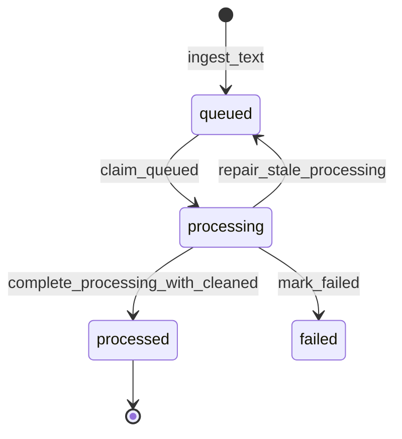

| State | Meaning | Written By |
| :--- | :--- | :--- |
| `queued` | Capture is stored and waiting for processing. | `ingest_text` |
| `processing` | Worker has claimed the event. | `claim_queued` |
| `processed` | Placeholder cleaner completed and cleaned staging was written in the same transaction. | `complete_processing_with_cleaned` |
| `failed` | Processing failed deterministically. | `mark_failed` |

`claim_queued` runs stale lease repair before claiming new work. Stale `processing`
rows are returned to `queued`, `retry_count` is incremented, and the row keeps an
error note recording the recovery event.

## 7. Implemented Ingestion Pipelines

### Manual Capture


### Local HTTP Capture

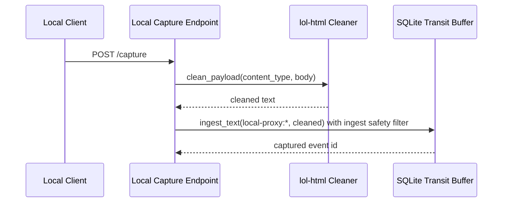

### Filesystem Capture

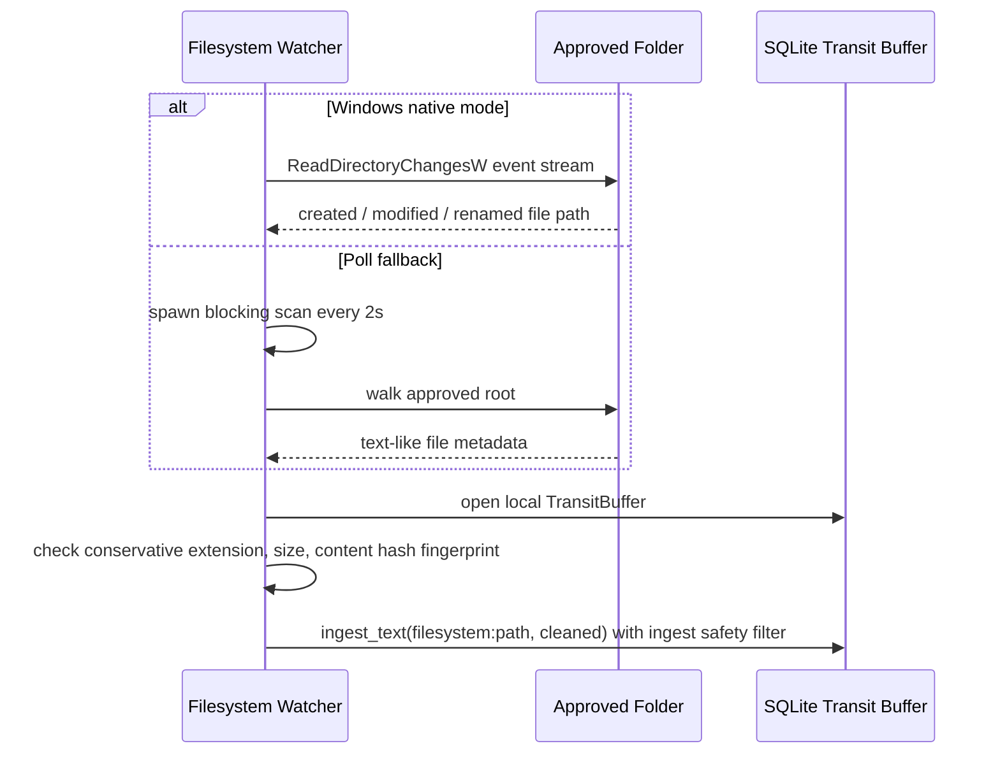

### Transit Processing

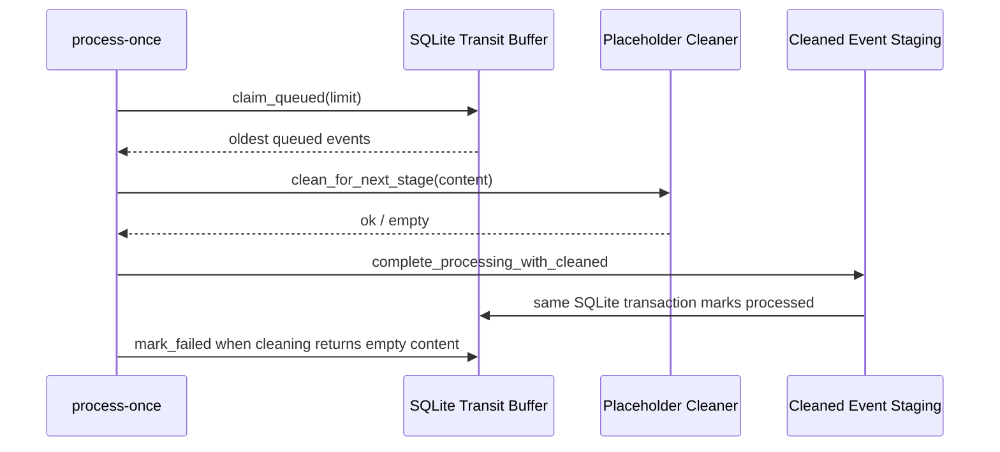

### Idle-Gated Transit Processing

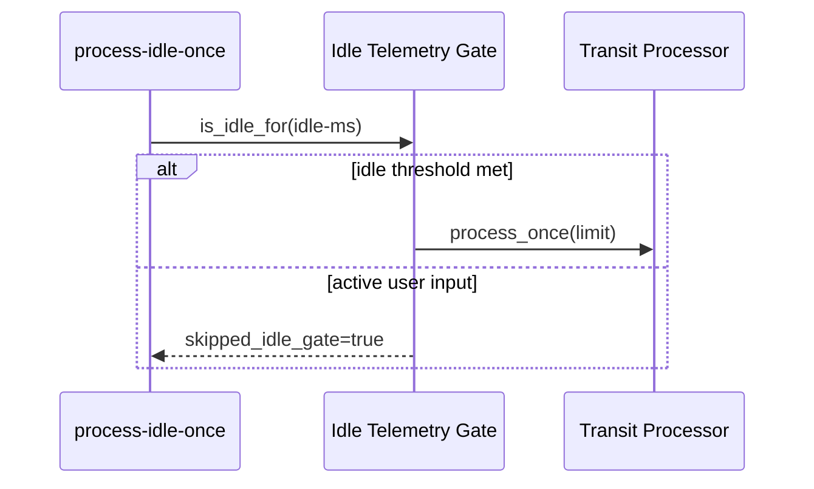

### Idle-Gated Local Pipeline

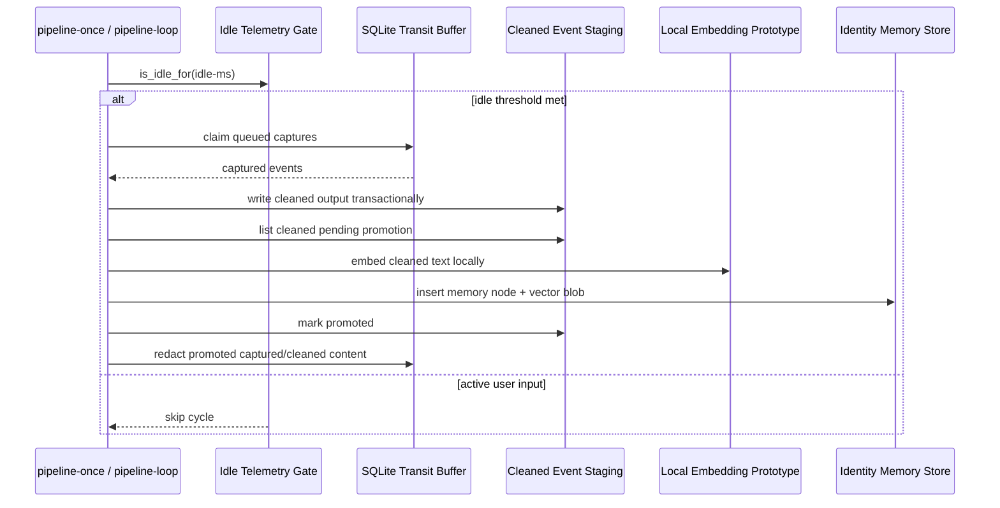

### Memory Promotion

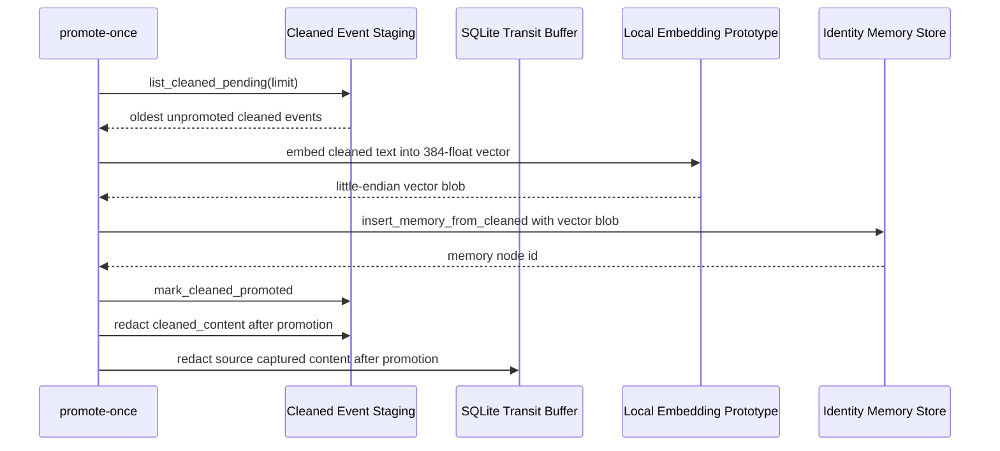

### Local Memory Retrieval

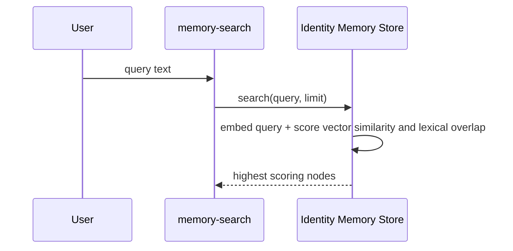

### Memory Vector Health

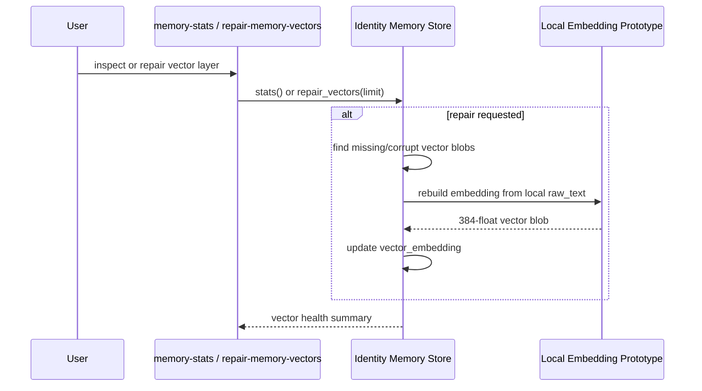

### Phase 1 Doctor

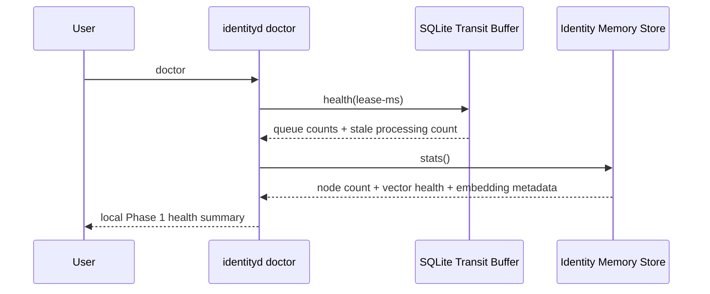

### Ephemeral Context Slice Preview

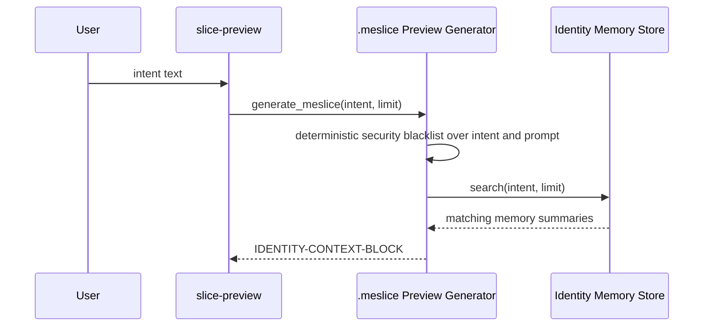

### Prompt Package Preview

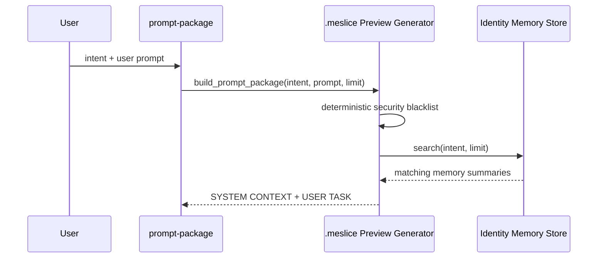

## 8. Planned Pipeline Boundaries

| Boundary | Upstream | Downstream | Rule |
| :--- | :--- | :--- | :--- |
| Capture to transit | Proxy / filesystem / manual | Ingest safety filter, then SQLite transit buffer | Reject deterministic sensitive material before any SQLite persistence. |
| Transit to cleaned staging | SQLite transit buffer | Transit processor | Process only claimed events; successful cleaned writes and `processed` status updates share one SQLite transaction. |
| Cleaned staging to `.me` prototype | `cleaned_events` | Local embedding prototype, then identity memory store | Promote normalized text into local memory nodes with fixed-width vector blobs, then redact duplicate transit content. |
| Promoted transit to redacted transit | `captured_events`, `cleaned_events` | Transit redaction routine | Keep queue state, hashes, promotion markers, and redaction timestamps; clear duplicate content after `.me` insertion. |
| Idle gate to local state pipeline | Idle telemetry gate | Transit processor and memory promotion | Skip local synthesis/promotion while the user is active. |
| `.me` prototype to retrieval | Identity memory store | Local query caller | Return vector/lexical ranked memory nodes. |
| `.me` prototype to vector health | Identity memory store | Local CLI caller | Expose model metadata and repair missing/corrupt vector blobs locally. |
| `.me` prototype to `.meslice` preview | Identity memory store | `.meslice` generator | Export bounded declarative summaries only; no raw DB ids, hashes, sources, or scores. |
| `.meslice` preview to prompt package | `.meslice` generator | Local caller | Combine scoped context with user prompt without network transmission. |
| `.me` prototype to vectorization | `identity.me/state.db` | Local embedder | Embed memory nodes, not raw capture rows. |
| Vectorization to `.me` graph | Embedder | LanceDB graph | Write structured memories, not raw telemetry. |
| `.me` to `.meslice` | Boundary engine | External agent | Export minimum declarative facts only. |
| External execution to feedback | Agent endpoint | Session watcher | Capture only scoped task outputs. |
| Feedback to `.me` | Delta extractor | Graph reconciler | Validate deltas before merge. |

## 9. Maintenance Rules

When changing the system, update this file in the same pass if any of the following change:

- A new crate, module, command, or local store is added.
- A pipeline gains or loses a stage.
- A state transition changes.
- A new external boundary appears.
- A planned component becomes implemented.
- A dependency changes the architecture or performance budget.

Keep this map factual. Mark future components as `Planned`; do not imply they are implemented before code exists.
